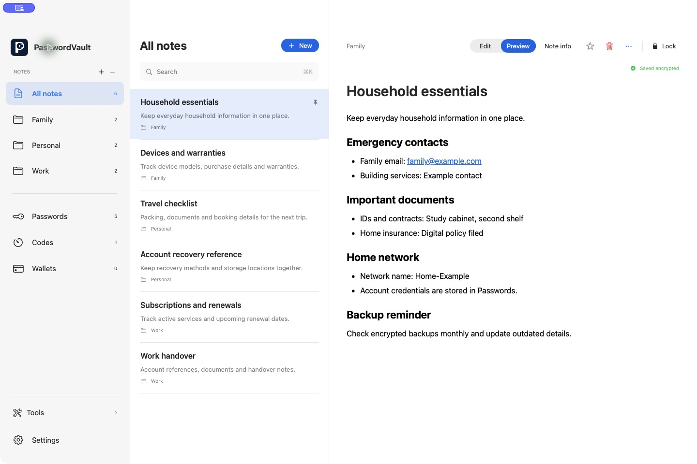
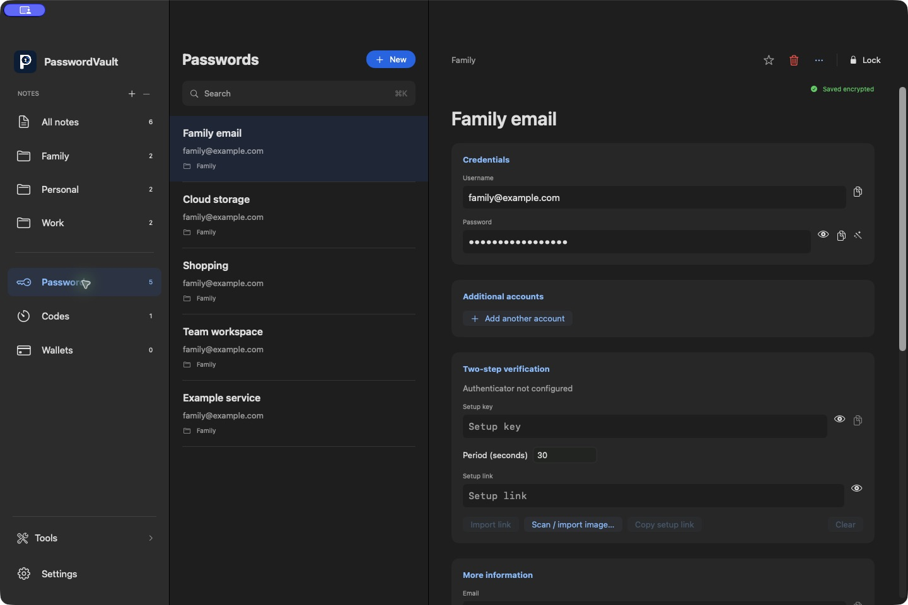
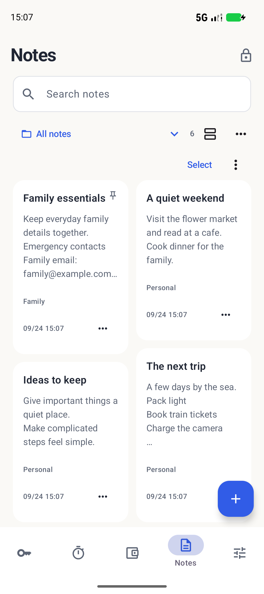
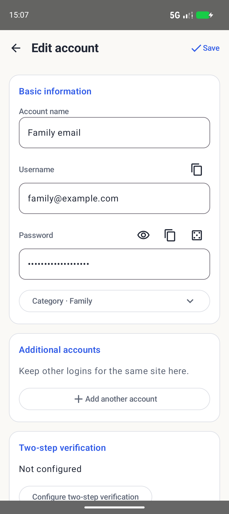

<div align="center">
  
  <h1>PasswordVault</h1>
  <p><strong>Notes, passwords and authenticator codes, together on Mac.</strong></p>
  <p>A local-first macOS app, native mobile previews and a lightweight browser extension.</p>
  <p><strong>English</strong> · <a href="README.zh-CN.md">简体中文</a></p>

**[Quick start](#run-from-source)** · **[Screenshots](#screenshots)** · **[Platforms](#platforms)** · **[Development](docs/DEVELOPMENT.md)**

</div>

> **Developer preview.** Use fictional credentials for evaluation. Native V2 encrypts stored vault data and does not persist the master password, but independent security review, broader device testing and distribution gates remain open. See the [security model](docs/SECURITY_MODEL.md).



## What you can do

- **Write and organize on Mac.** A three-column workspace with folders, search, favorites, pins and Trash. New creates an entry immediately; edit its details in place with encrypted autosave.
- **Edit Markdown directly.** The locally bundled Milkdown editor renders headings, lists, task items, tables and code. Keep editing in the document, use undo/redo, or switch to Markdown source after the editor hands over its latest input.
- **Keep complete account records.** Main and additional logins, independent password reveal/copy/generation, history, multiple domains, linked TOTP and wallet address/key/recovery-phrase fields.
- **Back up and recover.** Versioned encrypted backups and tested legacy readers; Mac/mobile WebDAV shows backup time and size, distinguishes server and backup passwords, and asks before merging a restore.
- **Use credentials in your browser.** Choose an account beside a supported password field, review and edit a detected login before saving, or open a saved account in Mac. Editing and filling are separate actions; login forms are never automatically submitted.
- **Continue on native mobile previews.** Android Compose and iOS SwiftUI share the Rust encryption core, with notes, credentials, encrypted drafts, Trash, backup/WebDAV, system Autofill and V2 sharing. Their [acceptance matrix](docs/MOBILE-IMPLEMENTATION.md) records platform-specific limits.

The Mac shell is SwiftUI; only Markdown editing uses a local WKWebView. The extension is TypeScript/Preact with no Flutter or CanvasKit runtime. It can connect to Mac or use a **separate** encrypted browser vault. Standalone Web currently has a smaller feature set.

## Screenshots

These native interfaces use fictional data. They are not the older Flutter gallery or design mockups.

### Mac account details



### Android preview

<p align="center">
  
  
</p>

More evidence: [Mac workflows](docs/design/macos-native/INTERACTION-AUDIT.md) · [Android UI and migration](docs/ANDROID-LEGACY-PARITY.md) · [Browser workflows](docs/BROWSER-ACCEPTANCE.md).

## Platforms

| Client | Current scope | Validation and delivery |
| --- | --- | --- |
| **macOS 13+** | SwiftUI desktop app; universal Apple Silicon/Intel build; local Milkdown editor | Development build. Current checks cover 57 Swift tests and isolated UI editing, lists, undo/redo source handover and long-document caret scrolling. Physical IME coverage, macOS 13/Intel hardware and distribution signing/notarization remain open |
| **Android 7.0+** | Kotlin/Compose preview; account/code/wallet workflows aligned with the legacy app, separate Notes design | Emulator UI plus scoped physical non-UI checks. Camera/fingerprint, older devices and original production-signing-key upgrades remain gated. System Autofill requires Android 8+ |
| **iOS 16+ / iPadOS 16+** | SwiftUI app and Password AutoFill extension | Simulator flows and device-architecture compilation pass. Eligible team provisioning, signed-device installation and hardware acceptance remain open |
| **Chromium extension** | Lightweight MV3; Mac connection and independent vault; explicit fill/save | Scoped Edge/ego lite, DOM and signed-helper checks. Broader Google Chrome/site coverage remains open; unpacked installation |
| **Standalone Web** | Independent encrypted vault, CRUD, TOTP, backup/import and utilities | Sharing/WebDAV/QR UI, full theme/language parity and automatic legacy OPFS migration remain incomplete |
| **Windows / Linux desktop** | No native desktop client | Not implemented |

This increment targets **Mac 2.0.9 build 13**; the browser remains **2.0.9**. Android preview is **2.1.6 / 21008**; iOS preview is **2.1.1 / 3**. Local versions and test results do not imply a public or store release. See [native migration](docs/NATIVE-MIGRATION.md) and [mobile artifacts](docs/MOBILE-IMPLEMENTATION.md#current-preview-artifacts).

## Run from source

### Mac and browser

Install the pinned Rust, Node.js, Xcode and XcodeGen tools from [native setup](docs/NATIVE-MIGRATION.md#build-and-launch), then run from the repository root:

```bash
git clone https://github.com/JunWeiUp/PasswordVault.git
cd PasswordVault
bash tool/check_native.sh core
bash tool/check_native.sh macos
bash tool/check_native.sh browser
```

The Mac app is built at `apps/macos/build/Build/Products/Release/PasswordVault.app`; the unpacked extension is in `apps/browser/dist`. The Mac build also bundles the note editor and its dependency licenses locally. For evaluation, follow the native guide's **isolated synthetic vault** instructions.

1. Load `apps/browser/dist` from `chrome://extensions` or `edge://extensions` with developer mode enabled.
2. For Mac mode, register the browser connection in **Mac Settings → Browser**, select **Connect to Mac** in the extension and confirm pairing in Mac.
3. Alternatively, create an **Independent vault** in the extension. It does not copy or share the Mac vault automatically.

Keep the unpacked directory and extension identity stable. Every delivered extension update uses `npm --prefix apps/browser run release:local`; reload it and verify the running version. Standalone Web can serve the same directory over loopback HTTP or HTTPS; `file://` is unsupported.

### Android and iOS

Follow the dedicated [Android build guide](apps/android/README.md) or [iOS build guide](apps/ios/README.md). Preview identities are separate from legacy production installations. Do not uninstall an existing vault to work around a signing mismatch.

## Data, safety and remaining work

Native V2 uses SQLCipher/authenticated document encryption, salted Argon2id root-key wrapping and authenticated browser ciphertext. Local notes and server credentials use the same encrypted vault path. The Milkdown page has no remote editor assets or persistent web-data store; its CSP blocks network content. Decrypted content still exists in memory while unlocked, and explicit plaintext exports remain plaintext.

Implemented features, automated checks and manual acceptance are recorded separately. Remaining work includes full process/GPU memory comparisons, standalone Web parity, unsupported desktop SQLite/Web OPFS and legacy-sharing migration, broader hardware/accessibility/server checks, production signing and independent security review. A smaller extension package is not proof of lower total process memory.

See [current plans](TODO.md), [security limitations](docs/SECURITY_MODEL.md) and [privacy](PRIVACY.md). Report vulnerabilities through [SECURITY.md](SECURITY.md); never attach real credentials or vault exports.

## Development and documentation

Use [development checks](docs/DEVELOPMENT.md), the [artifact registry](docs/REGISTRY.md) and [release procedure](docs/DEPLOYMENT.md). Native workflow source is in [.github/workflows/native.yml](.github/workflows/native.yml); use actual PR results when reporting CI status. Contribute with synthetic fixtures and follow [CONTRIBUTING.md](CONTRIBUTING.md) and [AGENTS.md](AGENTS.md).

| Topic | Guides |
| --- | --- |
| Product and interface | [Project specification](docs/PROJECT-SPEC.md) · [Design](DESIGN.md) · [Page structure](docs/PAGE-STRUCTURE.md) |
| Implementation | [Architecture](docs/ARCHITECTURE.md) · [Component guidelines](docs/COMPONENT-GUIDELINES.md) |
| Platform evidence | [Native migration](docs/NATIVE-MIGRATION.md) · [Mac field parity](docs/MAC-MOBILE-PARITY.md) · [Mobile acceptance](docs/MOBILE-IMPLEMENTATION.md) · [Android parity](docs/ANDROID-LEGACY-PARITY.md) · [Browser acceptance](docs/BROWSER-ACCEPTANCE.md) |
| Progress | [TODO](TODO.md) · [Changelog](CHANGELOG.md) |

## Legacy Flutter client

The retained `lib/`, `android/`, `ios/`, `web/` and `chrome/` clients have separate storage and security findings. They remain available until their replacement and migration gates pass. The older [Flutter preview download](https://github.com/JunWeiUp/PasswordVault/releases/tag/v1.1.0-preview.4), [widget gallery](docs/images/README.md) and [installation guide](docs/GETTING_STARTED.md) describe that client, not the native screenshots above. Its toolchain remains pinned in [.flutter-version](.flutter-version).

## License

[MIT](LICENSE). Bundled dependencies retain their own licenses; see [third-party notices](THIRD_PARTY_NOTICES.md).
