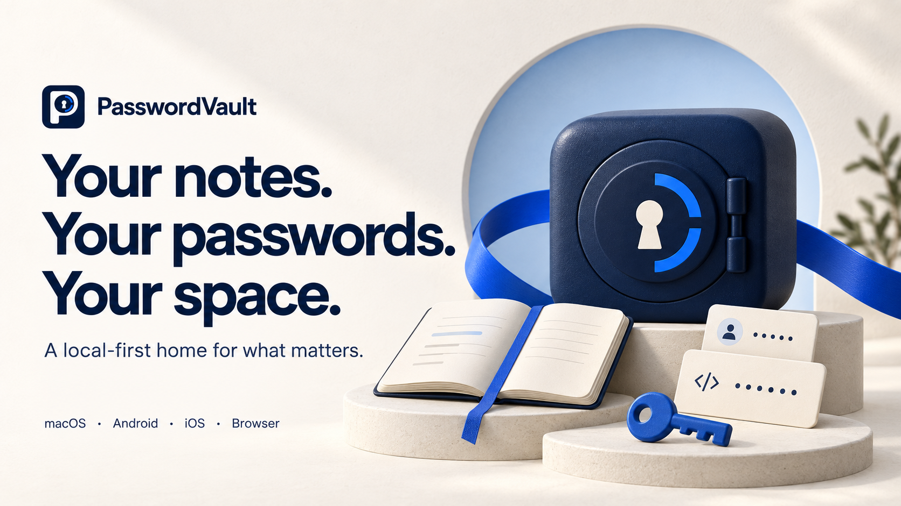

<p align="center">
  
</p>

<div align="center">
  <h1>PasswordVault</h1>
  <p><strong>A quieter place for your digital life.</strong></p>
  <p>Bring notes, passwords, authenticator codes and wallet records together.<br>Write on Mac, keep things close on mobile, and fill logins in your browser.</p>
  <p><strong>English</strong> · <a href="README.zh-CN.md">简体中文</a></p>
  <p><a href="#run-from-source"><strong>Get started</strong></a> &nbsp; · &nbsp; <a href="#see-it-in-action">Explore the app</a> &nbsp; · &nbsp; <a href="#choose-your-workspace">Choose your platform</a></p>
</div>

**Local-first · Encrypted storage · Open source**

Native clients are in **developer preview**. [Platform availability](#choose-your-workspace) and the [security model](docs/SECURITY_MODEL.md) describe current limits; an independent security review is still pending.

## Less searching. More doing.

- **Write freely.** On Mac, notes feel like documents, with live Markdown, undo/redo and encrypted autosave. Organize with folders, search, favorites and pins.
- **Keep the details together.** Passwords, additional logins, authenticator codes and wallet records, with the fields you actually need.
- **Get back to your day.** Choose an account beside a supported password field. Review new logins before saving them, and edit existing ones on Mac.

Deleted something? Recover it from Trash. Moving your data? Create an encrypted backup or manage backups on your own WebDAV server.

## See it in action

### A desktop workspace with room to think

A familiar three-column Mac layout keeps folders, notes and your document in view. Headings, lists and tasks take shape as you type, with Markdown source one step away.


<details>
<summary><strong>Look inside an account</strong> — passwords, additional logins and linked codes</summary>

Edit details in place, reveal or copy individual passwords, generate replacements and keep password history. Add multiple websites, extra logins and a linked authenticator without scattering the record across screens.


</details>

### Small screen. Same essentials.

Native mobile previews bring notes, accounts, codes and wallets into a touch-friendly workspace. Notes have their own reading-focused layout; familiar actions stay consistent across pages.

<p align="center">
  
  &nbsp;&nbsp;
  
</p>

<p align="center"><sub>Actual Mac and Android preview interfaces. All entries shown are fictional.</sub></p>

### Your browser, with a little less typing

Choose a saved account next to a supported password field. Review a detected login before saving it, or open an existing account in Mac to edit its details. Filling never submits the form for you.

The lightweight Chromium extension connects to Mac or uses its own **separate encrypted vault**. It has no Flutter or CanvasKit runtime. [Explore browser setup →](docs/NATIVE-MIGRATION.md#build-and-launch)

## Choose your workspace

| Platform | What you can use | Start here |
| --- | --- | --- |
| **Mac · macOS 13+** | Native desktop preview, notes editor and browser connection | [Mac setup](docs/NATIVE-MIGRATION.md#build-and-launch) |
| **Android · 7.0+** | Native mobile preview; system Autofill on Android 8+ | [Android guide](apps/android/README.md) |
| **iPhone / iPad · iOS 16+** | Native simulator preview; signed-device distribution pending | [iOS guide](apps/ios/README.md) |
| **Chromium browsers** | Unpacked extension; connect to Mac or create a separate vault | [Extension setup](#run-from-source) |

Standalone Web is also available with a smaller feature set. Windows and Linux have no native desktop client yet. These are development builds, not App Store or extension-store releases. Moving between separate vaults requires an explicit transfer; installation does not automatically sync them.

<details>
<summary>Versions, platform validation and remaining delivery gates</summary>

| Client | Current scope | Validation and delivery |
| --- | --- | --- |
| **macOS 13+** | SwiftUI desktop app; universal Apple Silicon/Intel build; local Milkdown editor | Development build. Current checks cover 57 Swift tests and isolated UI editing, lists, undo/redo source handover and long-document caret scrolling. Physical IME coverage, macOS 13/Intel hardware and distribution signing/notarization remain open |
| **Android 7.0+** | Kotlin/Compose preview; account/code/wallet workflows aligned with the legacy app, separate Notes design | Emulator UI plus scoped physical non-UI checks. Camera/fingerprint, older devices and original production-signing-key upgrades remain gated. System Autofill requires Android 8+ |
| **iOS 16+ / iPadOS 16+** | SwiftUI app and Password AutoFill extension | Simulator flows and device-architecture compilation pass. Eligible team provisioning, signed-device installation and hardware acceptance remain open |
| **Chromium extension** | Lightweight MV3; Mac connection and independent vault; explicit fill/save | Scoped Edge/ego lite, DOM and signed-helper checks. Broader Google Chrome/site coverage remains open; unpacked installation |
| **Standalone Web** | Independent encrypted vault, CRUD, TOTP, backup/import and utilities | Sharing/WebDAV/QR UI, full theme/language parity and automatic legacy OPFS migration remain incomplete |
| **Windows / Linux desktop** | No native desktop client | Not implemented |

This increment targets **Mac 2.0.9 build 13**; the browser remains **2.0.9**. Android preview is **2.1.7 / 21009**; iOS preview is **2.1.1 / 3**. Local versions and test results do not imply a public or store release. See [native migration](docs/NATIVE-MIGRATION.md) and [mobile artifacts](docs/MOBILE-IMPLEMENTATION.md#current-preview-artifacts).

</details>

## Run from source

### Mac and browser

Install the pinned Rust, Node.js, Xcode and XcodeGen tools from [native setup](docs/NATIVE-MIGRATION.md#build-and-launch), then run from the repository root:

```bash
git clone https://github.com/JunWeiUp/PasswordVault.git
cd PasswordVault
bash tool/check_native.sh core
bash tool/check_native.sh macos
bash tool/check_native.sh browser
```

The Mac app is built at `apps/macos/build/Build/Products/Release/PasswordVault.app`; the unpacked extension is in `apps/browser/dist`. The Mac build also bundles the note editor and its dependency licenses locally. For evaluation, follow the native guide's **isolated synthetic vault** instructions.

1. Load `apps/browser/dist` from `chrome://extensions` or `edge://extensions` with developer mode enabled.
2. For Mac mode, register the browser connection in **Mac Settings → Browser**, select **Connect to Mac** in the extension and confirm pairing in Mac.
3. Alternatively, create an **Independent vault** in the extension. It does not copy or share the Mac vault automatically.

Keep the unpacked directory and extension identity stable. Every delivered extension update uses `npm --prefix apps/browser run release:local`; reload it and verify the running version. Standalone Web can serve the same directory over loopback HTTP or HTTPS; `file://` is unsupported.

### Android and iOS

Follow the dedicated [Android build guide](apps/android/README.md) or [iOS build guide](apps/ios/README.md). Preview identities are separate from legacy production installations. Do not uninstall an existing vault to work around a signing mismatch.

## Your data stays yours

Native vaults encrypt notes, accounts, codes, wallet records and settings on disk, including while the app is open. You choose when to create a backup or connect your own WebDAV server. Unlocked content exists in memory; an explicit plaintext export is still plaintext.

<details>
<summary>Encryption, security boundaries and remaining work</summary>

Native V2 uses SQLCipher/authenticated document encryption, salted Argon2id root-key wrapping and authenticated browser ciphertext. Local notes and server credentials use the same encrypted vault path. The Milkdown page has no remote editor assets or persistent web-data store; its CSP blocks network content. Decrypted content still exists in memory while unlocked, and explicit plaintext exports remain plaintext.

Implemented features, automated checks and manual acceptance are recorded separately. Remaining work includes full process/GPU memory comparisons, standalone Web parity, unsupported desktop SQLite/Web OPFS and legacy-sharing migration, broader hardware/accessibility/server checks, production signing and independent security review. A smaller extension package is not proof of lower total process memory.

See [current plans](TODO.md), [security limitations](docs/SECURITY_MODEL.md) and [privacy](PRIVACY.md). Report vulnerabilities through [SECURITY.md](SECURITY.md); never attach real credentials or vault exports.

</details>

## Build with us

CI runs only affected platform jobs for normal PRs; [selection, caching and full-run instructions](docs/CI.md).

Use [development checks](docs/DEVELOPMENT.md), the [artifact registry](docs/REGISTRY.md) and [release procedure](docs/DEPLOYMENT.md). Native workflow source is in [.github/workflows/native.yml](.github/workflows/native.yml); use actual PR results when reporting CI status. Contribute with synthetic fixtures and follow [CONTRIBUTING.md](CONTRIBUTING.md) and [AGENTS.md](AGENTS.md).

| Topic | Guides |
| --- | --- |
| Product and interface | [Project specification](docs/PROJECT-SPEC.md) · [Design](DESIGN.md) · [Page structure](docs/PAGE-STRUCTURE.md) |
| Implementation | [Architecture](docs/ARCHITECTURE.md) · [Component guidelines](docs/COMPONENT-GUIDELINES.md) |
| Platform evidence | [Native migration](docs/NATIVE-MIGRATION.md) · [Mac field parity](docs/MAC-MOBILE-PARITY.md) · [Mobile acceptance](docs/MOBILE-IMPLEMENTATION.md) · [Android parity](docs/ANDROID-LEGACY-PARITY.md) · [Browser acceptance](docs/BROWSER-ACCEPTANCE.md) |
| Progress | [TODO](TODO.md) · [Changelog](CHANGELOG.md) |

<details>
<summary>Looking for the older Flutter client?</summary>

The retained `lib/`, `android/`, `ios/`, `web/` and `chrome/` clients have separate storage and security findings. They remain available until their replacement and migration gates pass. The older [Flutter preview download](https://github.com/JunWeiUp/PasswordVault/releases/tag/v1.1.0-preview.4), [widget gallery](docs/images/README.md) and [installation guide](docs/GETTING_STARTED.md) describe that client, not the native screenshots above. Its toolchain remains pinned in [.flutter-version](.flutter-version).

</details>

## License

[MIT](LICENSE). Bundled dependencies retain their own licenses; see [third-party notices](THIRD_PARTY_NOTICES.md).
