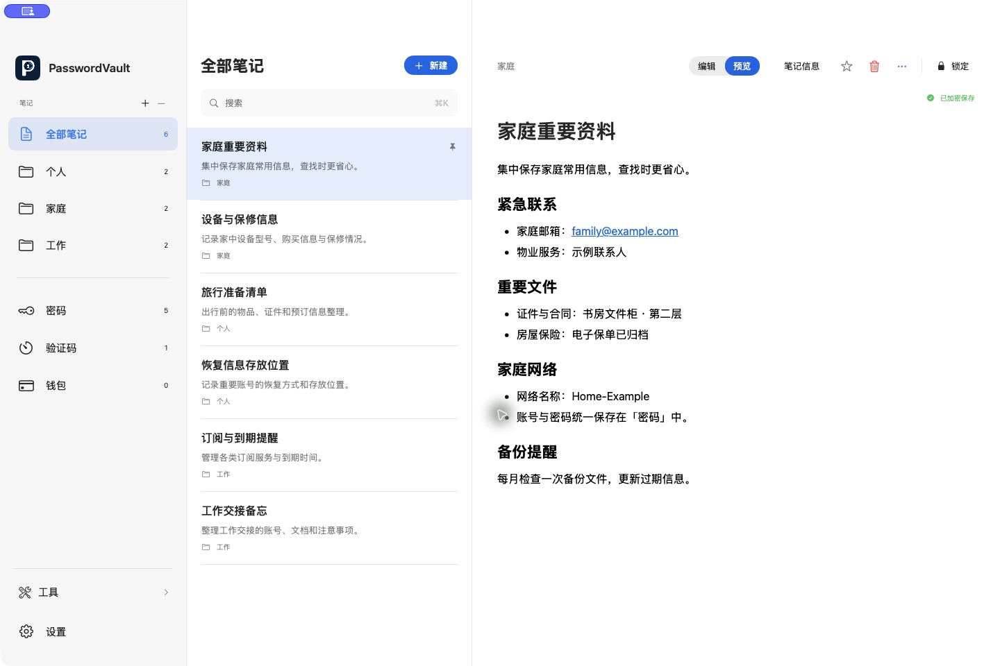
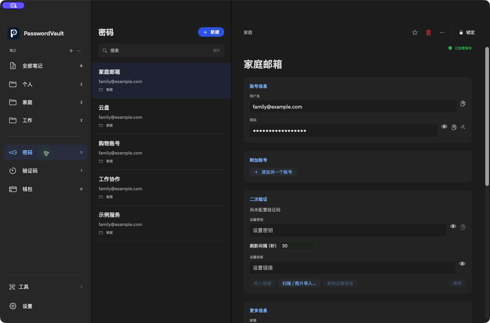
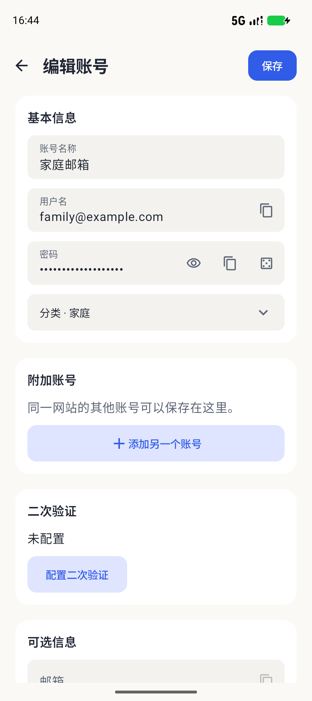

<p align="center">
  
</p>

<div align="center">
  <h1>PasswordVault</h1>
  <p><strong>把重要的事，安放在一起。</strong></p>
  <p>笔记、密码、验证码与钱包资料，一处整理。<br>在 Mac 上安心记录，在手机上随手查阅，在浏览器中轻松填充。</p>
  <p><a href="README.md">English</a> · <strong>简体中文</strong></p>
  <p><a href="#快速开始"><strong>开始使用</strong></a> &nbsp; · &nbsp; <a href="#看看实际体验">看看实际体验</a> &nbsp; · &nbsp; <a href="#选择你的工作空间">选择平台</a></p>
</div>

**本地优先 · 加密存储 · 开源**

原生客户端目前为**开发预览版**。[平台状态](#选择你的工作空间)与[安全模型](docs/SECURITY_MODEL.md)记录当前限制，独立安全审查仍待完成。

## 少一点翻找，多一点从容

- **随时记下想法。** 在 Mac 上像写文档一样写笔记，支持实时 Markdown、撤销/重做与自动加密保存。分类、搜索、收藏和置顶，让想法有处可寻。
- **重要资料放在一起。** 密码、附加账号、验证码与钱包资料，常用字段一次整理完整。
- **登录后，继续手头的事。** 在支持的密码框旁选择账号，核对新的登录信息后再保存，需要修改时直接打开 Mac 中的记录。

误删了条目，可以从回收站找回；需要迁移资料，可以导出加密备份，或在自己的 WebDAV 服务器上管理备份。

## 看看实际体验

### 在桌面上，留出思考的空间

熟悉的 Mac 三栏布局，把分类、笔记列表与正文放在眼前。标题、列表与待办随输入自然呈现，需要时也能切换到 Markdown 源码。



<details>
<summary><strong>展开账号详情</strong> — 密码、附加账号与关联验证码</summary>

直接编辑资料，分别查看或复制密码，生成新密码并保留历史。多个网站、附加账号与关联验证码，都能收在同一条记录中。



</details>

### 小屏幕，也装得下日常所需

原生移动预览版将笔记、账号、验证码与钱包带到手机。笔记采用适合阅读的独立布局，各页面保留一致的常用操作。

<p align="center">
  
  &nbsp;&nbsp;
  
</p>

<p align="center"><sub>Mac 与 Android 预览版的实际界面，展示内容均为虚构资料。</sub></p>

### 在浏览器里，少输几次密码

在支持的密码框旁选择已保存的账号；检测到登录后，核对资料再保存。需要修改时，从插件直接打开 Mac 中的对应账号。填充后由你决定是否提交表单。

轻量 Chromium 插件可以连接 Mac，也可以创建**数据分开的独立加密资料库**，不包含 Flutter 或 CanvasKit 运行时。[查看浏览器配置 →](docs/NATIVE-MIGRATION.md#build-and-launch)

## 选择你的工作空间

| 平台 | 当前可用形式 | 使用入口 |
| --- | --- | --- |
| **Mac · macOS 13+** | 原生桌面预览版，笔记编辑与浏览器连接 | [Mac 配置](docs/NATIVE-MIGRATION.md#build-and-launch) |
| **Android · 7.0+** | 原生移动预览版；Android 8+ 支持系统自动填充 | [Android 指南](apps/android/README.md) |
| **iPhone / iPad · iOS 16+** | 原生模拟器预览；签名设备分发待完成 | [iOS 指南](apps/ios/README.md) |
| **Chromium 浏览器** | 解压安装插件，连接 Mac 或创建独立资料库 | [插件配置](#快速开始) |

另有功能范围较小的独立 Web；Windows 与 Linux 暂无原生桌面客户端。以上是开发版本，尚未上架应用商店或扩展商店。独立资料库之间需要明确迁移数据，安装应用不会自动同步。

<details>
<summary>版本、平台验证与待完成的发行工作</summary>

| 客户端 | 当前能力 | 验证与交付状态 |
| --- | --- | --- |
| **macOS 13+** | SwiftUI 桌面应用，Apple Silicon/Intel 通用构建，本地 Milkdown 编辑器 | 开发版本。当前 57 项 Swift 测试及隔离 UI 覆盖编辑、列表、撤销/重做、源码交接及长文光标滚动。实体输入法覆盖、macOS 13/Intel 硬件、发行签名和公证仍待完成 |
| **Android 7.0+** | Kotlin/Compose 预览；账号/验证码/钱包对齐旧版操作，笔记采用独立设计 | 已有模拟器 UI 和限定实机非 UI 检查；相机/指纹、旧设备与原生产签名升级仍待验收。系统自动填充需要 Android 8+ |
| **iOS 16+ / iPadOS 16+** | SwiftUI 应用与 Password AutoFill 扩展 | 模拟器流程及设备架构编译通过；合格团队配置、签名设备安装和硬件验收仍未完成 |
| **Chromium 扩展** | 轻量 MV3，Mac 连接和独立资料库，明确选择后填充/保存 | 已有限定 Edge/ego lite、DOM 和签名 helper 检查；更广的 Google Chrome/网站覆盖待完成，采用解压安装 |
| **独立 Web** | 独立加密资料库、增删改查、TOTP、备份/导入和工具 | 共享/WebDAV/QR 界面、完整主题/语言对齐及旧 OPFS 自动迁移尚未完成 |
| **Windows / Linux 桌面** | 无原生桌面客户端 | 尚未实现 |

本轮目标为 **Mac 2.0.9 build 13**，浏览器保持 **2.0.9**。Android 预览为 **2.1.7 / 21009**，iOS 预览为 **2.1.1 / 3**。本地版本和测试结果不代表已公开发布或上架，详见[原生迁移](docs/NATIVE-MIGRATION.md)及[移动端产物](docs/MOBILE-IMPLEMENTATION.md#current-preview-artifacts)。

</details>

## 快速开始

### Mac 与浏览器

先按[原生安装说明](docs/NATIVE-MIGRATION.md#build-and-launch)准备固定版本的 Rust、Node.js、Xcode 和 XcodeGen，再从仓库根目录运行：

```bash
git clone https://github.com/JunWeiUp/PasswordVault.git
cd PasswordVault
bash tool/check_native.sh core
bash tool/check_native.sh macos
bash tool/check_native.sh browser
```

Mac 应用生成于 `apps/macos/build/Build/Products/Release/PasswordVault.app`，解压扩展位于 `apps/browser/dist`。Mac 构建会将编辑器及依赖许可一同本地打包。评估时请使用原生指南中的**隔离虚构资料库**流程。

1. 在 `chrome://extensions` 或 `edge://extensions` 开启开发者模式，加载 `apps/browser/dist`。
2. 使用 Mac 模式时，先在 **Mac 设置 → 浏览器**登记连接，再在插件选择**连接 Mac**，并在 Mac 中确认配对。
3. 也可在插件中创建**独立资料库**，它不会自动复制或共享 Mac 数据。

保持扩展目录和身份稳定。每次交付更新使用 `npm --prefix apps/browser run release:local`，重载后核对实际版本。独立 Web 可通过本机 HTTP 或 HTTPS 托管同一目录，不支持 `file://`。

### Android 与 iOS

分别按 [Android 构建指南](apps/android/README.md)或 [iOS 构建指南](apps/ios/README.md)操作。预览标识与旧生产安装分开，不要卸载已有资料库来绕过签名不匹配。

## 资料由你掌握

原生资料库在磁盘上加密保存笔记、账号、验证码、钱包与设置，应用打开时也一样。由你决定何时备份，以及是否连接自己的 WebDAV 服务器。解锁内容会存在于内存，主动导出的明文文件仍是明文。

<details>
<summary>加密方式、安全边界与剩余工作</summary>

原生 V2 使用 SQLCipher、认证文档加密、带随机盐的 Argon2id 根密钥包装及浏览器认证密文包。本地笔记和服务器凭据沿用同一加密资料库路径。Milkdown 页面不加载远程编辑器资源、不使用持久网站数据存储，CSP 阻止网络内容。解锁时，解密内容仍存在于内存；明确导出的明文文件仍是明文。

已实现功能、自动化检查和人工验收分开记录。剩余工作包括完整进程/GPU 内存对比、独立 Web 对齐、不支持的桌面 SQLite/Web OPFS 与旧共享迁移、更广的硬件/无障碍/服务器检查、生产签名和独立安全审查。插件体积更小，不等于总进程内存已经完成对比。

详见[当前计划](TODO.md)、[安全限制](docs/SECURITY_MODEL.md)及[隐私说明](PRIVACY.md)。漏洞按 [SECURITY.md](SECURITY.md)报告，不要附上真实凭据或资料库导出文件。

</details>

## 一起完善 PasswordVault

普通 PR 只运行受影响平台的任务，详见 [CI 范围、缓存与完整运行说明](docs/CI.md)。

使用[开发检查](docs/DEVELOPMENT.md)、[产物登记](docs/REGISTRY.md)及[发布流程](docs/DEPLOYMENT.md)。原生工作流位于 [.github/workflows/native.yml](.github/workflows/native.yml)，报告 CI 状态时以实际 PR 运行结果为准。贡献使用虚构测试数据，并遵循 [CONTRIBUTING.md](CONTRIBUTING.md)与 [AGENTS.md](AGENTS.md)。

| 主题 | 文档 |
| --- | --- |
| 产品与界面 | [项目规格](docs/PROJECT-SPEC.md) · [设计](DESIGN.md) · [页面结构](docs/PAGE-STRUCTURE.md) |
| 实现 | [架构](docs/ARCHITECTURE.md) · [组件规范](docs/COMPONENT-GUIDELINES.md) |
| 平台证据 | [原生迁移](docs/NATIVE-MIGRATION.md) · [Mac 字段对齐](docs/MAC-MOBILE-PARITY.md) · [移动端验收](docs/MOBILE-IMPLEMENTATION.md) · [安卓对齐](docs/ANDROID-LEGACY-PARITY.md) · [浏览器验收](docs/BROWSER-ACCEPTANCE.md) |
| 进度 | [TODO](TODO.md) · [更新记录](CHANGELOG.md) |

<details>
<summary>寻找旧版 Flutter 客户端？</summary>

保留的 `lib/`、`android/`、`ios/`、`web/`、`chrome/` 客户端具有独立的存储与安全问题，等待对应替代及迁移路径验收后再移除。[旧 Flutter 预览下载](https://github.com/JunWeiUp/PasswordVault/releases/tag/v1.1.0-preview.4)、[历史 widget 图库](docs/images/README.md)及[安装指南](docs/GETTING_STARTED.md)描述该客户端，不对应上面的原生截图。其工具链仍固定在 [.flutter-version](.flutter-version)。

</details>

## 许可证

[MIT](LICENSE)。打包依赖保留各自许可证，详见[第三方声明](THIRD_PARTY_NOTICES.md)。
