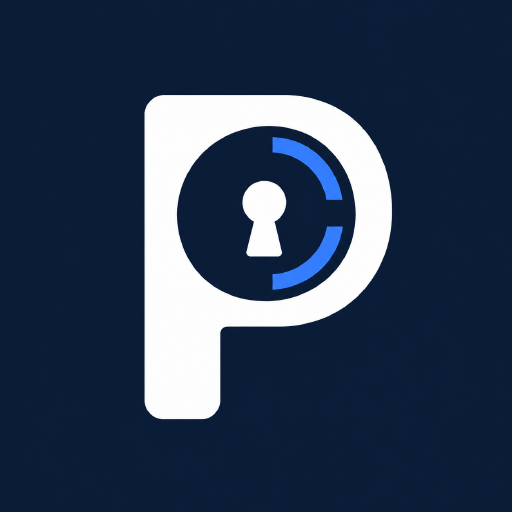
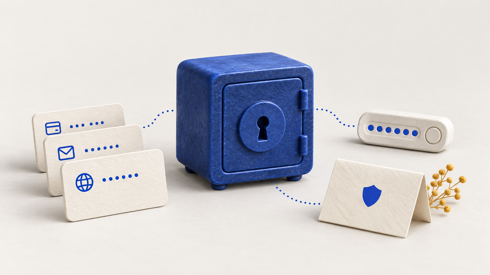
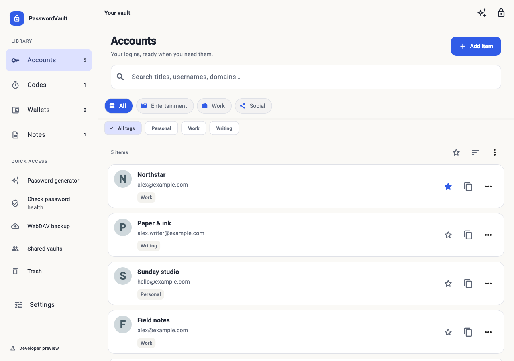
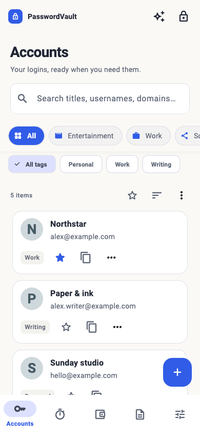
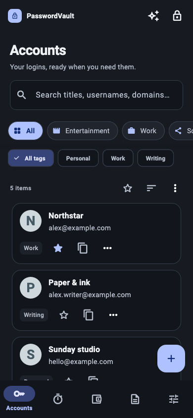
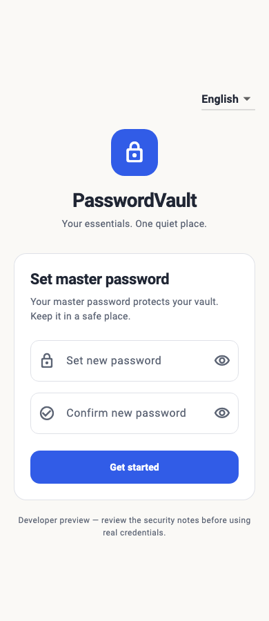
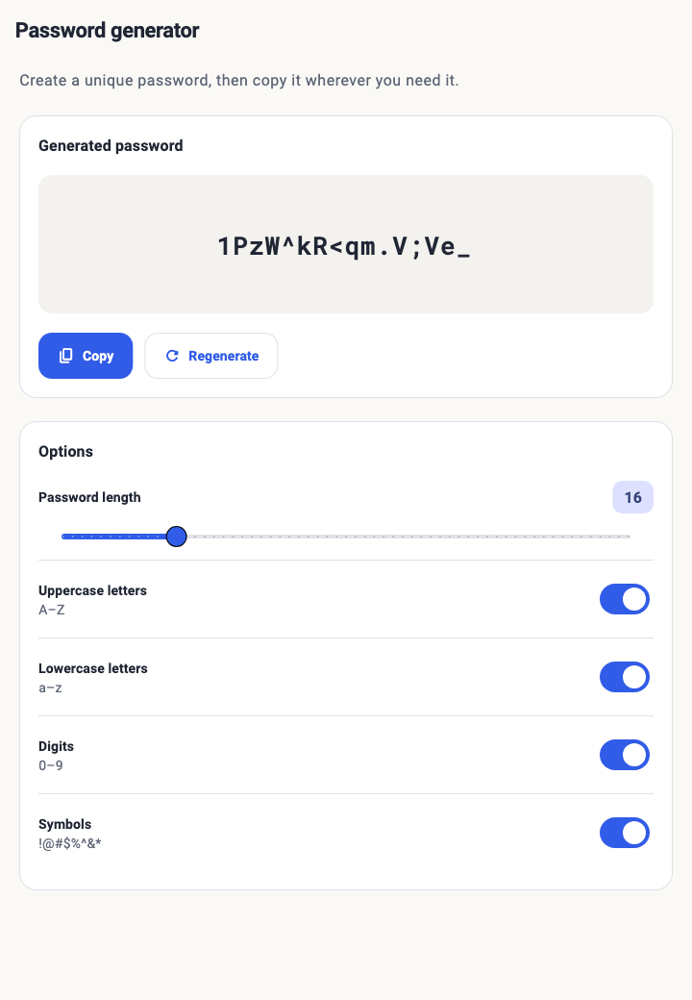

<div align="center">
  
  <h1>PasswordVault</h1>
  <h3>常用凭据，井井有条。</h3>
  <p>本地优先的密码、验证码、笔记和钱包凭据管理工具。</p>
  <p><a href="README.md">English</a> · <strong>简体中文</strong></p>
  
  <br><br>

**[体验开发预览版 ↗](https://github.com/JunWeiUp/PasswordVault/releases/tag/v1.1.0-preview.4)** &nbsp; · &nbsp; **[从源码构建](#从源码运行)**

<sub>Android 7.0+ · 实验性 Chromium 扩展与 Web · <a href="docs/GETTING_STARTED.md">安装与入门</a></sub>

[](https://github.com/JunWeiUp/PasswordVault/actions/workflows/ci.yml)
[](.flutter-version)
[](LICENSE)

**[看看界面](#看看界面)** · **[三步上手](#三步开始使用)** · **[完整功能](#完整功能说明)** · **[参与开发](#从源码运行)**

</div>

> **开发预览版，请使用虚构的测试凭据。** PasswordVault 尚未经过独立安全审计。[安全发布阻碍](docs/SECURITY_MODEL.md)包括主密码持久化、修改密码时的数据迁移、旧备份方案及实验性共享。下方展示当前源码的改版界面，链接中的预览安装包可能仍为旧版界面。

<table>
<tr>
<td width="33%" valign="top">

### 需要的账号，随手找得到。

搜索标题、用户名和域名，再用分类、标签缩小范围。常用条目加入收藏或置顶，少翻几次列表。

</td>
<td width="33%" valign="top">

### 相关的内容，放在一起。

密码、TOTP 验证码、笔记和钱包记录，都有各自的内容视图。在同一个应用里，按需要切换。

</td>
<td width="33%" valign="top">

### 下一步该做什么，一目了然。

生成密码、检查密码健康、管理备份。常用工具有清晰入口，不用在设置里反复寻找。

</td>
</tr>
</table>

## 看看界面

### 浏览时有条理，操作时有重点。

常驻搜索框、清晰的内容层级，以及随屏幕宽度调整的导航。蓝色突出主要操作，安静的背景把注意力留给条目本身。

<a href="docs/images/vault-desktop.png"></a>

### 同一个保管库，适合不同屏幕。

窄屏使用底部导航；浅色和深色外观保留相同的布局、标签与操作。空库可以直接添加测试条目，搜索无结果时可以清除条件，继续浏览。

<p align="center">
  <a href="docs/images/vault-mobile.png"></a>&nbsp;
  <a href="docs/images/vault-dark.png"></a>&nbsp;
  <a href="docs/images/lock.png"></a>
</p>

<sub>这些图片使用当前源码和虚构数据进行 Flutter widget 渲染，并非真机截图。宽屏展示的是应用响应式布局，不代表已有原生桌面版本。顶部图片是概念插画。[图片来源与复现说明](docs/images/README.md)。</sub>

<details>
<summary><b>再看一个细节：密码生成器</b></summary>

选择长度和字符类型，重新生成，然后复制。在浏览器扩展中，还可以填充到当前网页。

<p align="center"><a href="docs/images/generator.png"></a></p>

</details>

## 三步开始使用

1. **选择一种体验方式。** 安装 Android APK、加载解压后的 Chromium 扩展，或从源码运行新版设计。见[安装说明](docs/GETTING_STARTED.md#choose-a-build)。
2. **创建测试保管库。** 设置一个仅用于测试的主密码，添加 `hello@example.com` 这样的虚构账号。默认英文，可在锁屏页或**设置 → 外观**中切换简体中文。
3. **试试日常操作。** 搜索账号、生成密码，再复制示例凭据。导入内容前，先用虚构条目演练导出与恢复。见[首次使用与恢复检查](docs/GETTING_STARTED.md#your-first-session)。

**[安装与常见问题](docs/GETTING_STARTED.md)** · **[反馈问题](https://github.com/JunWeiUp/PasswordVault/issues/new/choose)** · **[产品设计规范](docs/PRODUCT_DESIGN.md)**

## 完整功能说明

| 类别 | 当前源码中的能力 |
| --- | --- |
| 账号管理 | 一个网站多个账号、多个域名、分类、标签、颜色、收藏、置顶、密码历史与回收站 |
| 其他条目 | TOTP 验证码、安全笔记与钱包凭据记录 |
| 常用工具 | 密码生成器，以及弱密码、重复密码、过期密码检查 |
| 自动填充 | Chromium Manifest V3 扩展；Android 自动填充服务 |
| 导入导出 | 导入 Chrome、Bitwarden、LastPass、1Password 的 CSV；导出 JSON/CSV，并提供加密选项 |
| 备份 | 使用自行配置的 WebDAV 服务器备份与恢复 |
| 协作 | 实验性的局域网同步与加密共享库 |
| 外观 | English 与简体中文；浅色、深色与跟随系统；窄屏和宽屏布局 |

源码中有相应功能，不等于已经完成安全验证或实际运行验证。共享、浏览器存储、生物识别、自动填充及恢复仍有具体的[安全](docs/SECURITY_MODEL.md)和[平台限制](docs/DEVELOPMENT.md#build)。

### 平台状态

| 平台 | 状态 | 体验方式 |
| --- | --- | --- |
| Android | 已签名的开发预览 APK，Android 7.0+ | 下载对应架构的 APK；较新的设备通常使用 `arm64-v8a` |
| Chrome / Edge 扩展 | 实验性，使用解压安装 | 解压扩展 ZIP，或运行 `bash tool/check.sh web` |
| Web | 实验性，存在浏览器存储和 CORS 限制 | 自行托管 Web ZIP，或运行 `flutter run -d chrome` |
| iOS | 有工程骨架，待真机和发布验证 | 需要 macOS、Xcode 和签名 |
| Windows / macOS / Linux 桌面 | 尚无对应 runner | 宽屏图片仅展示响应式布局 |

[现有开发预览版](https://github.com/JunWeiUp/PasswordVault/releases/tag/v1.1.0-preview.4)提供下载和校验和。目前尚未上架 Chrome Web Store、Google Play 或 App Store。源码版本为 [pubspec.yaml](pubspec.yaml) 中的 **1.1.0+6**；源码版本号不代表对应安装包已经发布。

## 从源码运行

使用 [.flutter-version](.flutter-version) 固定的 **Flutter 3.41.7 / Dart 3.11.5**。Android 需要 Java 17、SDK 36、NDK 27.0.12077973。完整工具链和架构见[开发指南](docs/DEVELOPMENT.md)。

```bash
git clone https://github.com/JunWeiUp/PasswordVault.git
cd PasswordVault
flutter pub get --enforce-lockfile
flutter gen-l10n
dart run build_runner build --delete-conflicting-outputs
flutter run -d chrome
```

连接 Android 设备后可执行 `flutter run`。内部包名 `password`、Android 应用 ID `com.securepass.vault` 及旧 `SecurePass` 标识保持稳定，以兼容已有数据。

### 检查与构建

本地与 CI 使用同一入口：

```bash
# 仓库检查、发布工具测试与浏览器扩展测试
bash tool/check.sh repo

# 锁定依赖、生成代码、格式、静态分析与 Flutter 测试
bash tool/check.sh flutter

# 调试 APK，不需要发布签名凭据
bash tool/check.sh android

# Web 与解压安装的 Chromium 扩展
bash tool/check.sh web

# 执行以上全部检查与构建
bash tool/check.sh all
```

在 `chrome://extensions` 或 `edge://extensions` 开启开发者模式，加载 `build/chrome_extension`。请保持解压目录稳定：扩展身份变化可能导致存储位置变化，重新安装前先备份测试数据。

### CI 与发布交付

PR、分支推送及手动运行，分别执行仓库检查、Flutter 质量检查和秘密扫描任务。CI 检查本地化、生成代码、格式、静态分析、测试与 Git 历史，再构建 **android-debug**、**web-preview** 和 **chromium-extension-preview** 产物。构建产物保留 14 天，覆盖率保留 7 天。CI 通过代表相应构建检查通过，不等于独立安全审计。

推送版本标签，或针对已有标签手动运行工作流，即可开始发布交付。流程核对版本和 Android 签名身份，将 APK/AAB、Web、扩展与构建元数据、SHA-256 校验文件打包，并 **直接公开发布开发预览版，不再创建草稿**。主分支推送生成 CI 构建产物；发布下载包需要推送新的版本标签。签名密钥、产物和审核清单见[发布指南](docs/RELEASING.md)。

## 安全与隐私

保管库字段使用 AES-256-GCM，常规保管库密钥使用 Argon2id；这些算法本身不能证明整个应用安全。当前实现仍会持久化主密码，Web 端还会保存在浏览器存储中；修改主密码时缺少事务性的保管库重新加密。旧备份派生、局域网共享和扩展存储也仍需审查。体验前请阅读完整的[安全模型与发布阻碍](docs/SECURITY_MODEL.md)。

CSV/JSON 导出可能包含明文凭据。WebDAV 会连接配置的服务器，网站图标可能访问第三方服务，局域网发现会暴露网络元数据。详见 [PRIVACY.md](PRIVACY.md)。不能将这个预览版描述为已审计、零知识或可安全用于生产环境。

报告漏洞请遵循 [SECURITY.md](SECURITY.md)，不要在 issue 中附上真实密码、私钥或保管库导出文件。

## 参与贡献

先阅读 [CONTRIBUTING.md](CONTRIBUTING.md)。欢迎安全修复、迁移测试、可访问性检查、翻译和真机验证。截图与问题报告请使用虚构数据。提交消息及 PR 标题使用英文 Conventional Commits，讨论欢迎中文和英文。

| 文档 | 内容 |
| --- | --- |
| [入门指南](docs/GETTING_STARTED.md) | 安装、首次使用与常见问题 |
| [产品设计](docs/PRODUCT_DESIGN.md) | 导航、交互模式、视觉方向与评审标准 |
| [开发指南](docs/DEVELOPMENT.md) | 架构、工具链与平台检查 |
| [国际化](docs/INTERNATIONALIZATION.md) | 新增与维护翻译 |
| [发布指南](docs/RELEASING.md) | CI、签名、打包与公开发布 |
| [路线图](docs/ROADMAP.md) · [更新记录](CHANGELOG.md) | 优先事项与变更记录 |

## 许可证

[MIT](LICENSE)。第三方组件遵循各自许可证，见 [THIRD_PARTY_NOTICES.md](THIRD_PARTY_NOTICES.md)。
