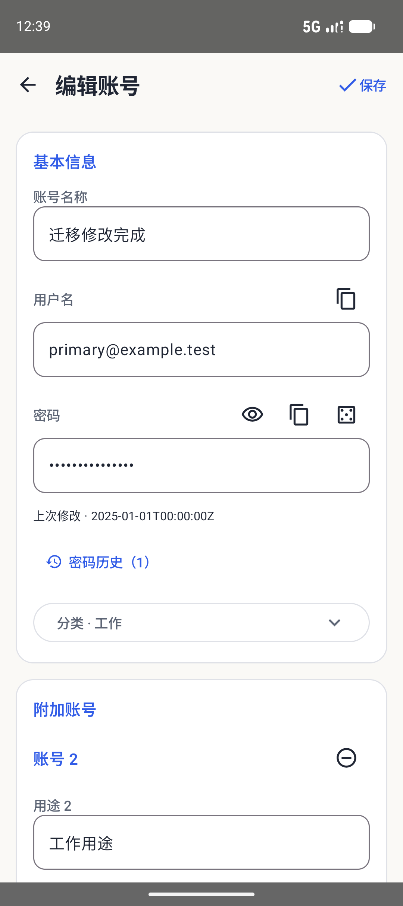

<div align="center">
  
  <h1>PasswordVault</h1>
  <p><strong>笔记、密码与验证码，在 Mac 上一处管理。</strong></p>
  <p>本地优先的 macOS 桌面应用，配有原生移动预览版和轻量浏览器扩展。</p>
  <p><a href="README.md">English</a> · <strong>简体中文</strong></p>

**[快速开始](#快速开始)** · **[界面截图](#界面截图)** · **[平台状态](#平台状态)** · **[开发指南](docs/DEVELOPMENT.md)**

</div>

> **开发预览版。** 请使用虚构凭据进行评估。原生 V2 加密保存资料库，不持久化主密码；独立安全审查、更广的设备测试和发行门槛仍未完成，详见[安全模型](docs/SECURITY_MODEL.md)。


## 可以做什么

- **在 Mac 上记录与整理。** 三栏工作区，支持分类、搜索、收藏、置顶和回收站。点击新建即创建条目，直接编辑详情并自动加密保存。
- **直接编辑 Markdown。** 本地打包的 Milkdown 渲染标题、列表、任务项、表格与代码。可在正文中连续编辑、撤销/重做，也可在最新输入完成交接后切换到 Markdown 源码。
- **保存完整账号资料。** 主账号与附加账号分别支持密码显隐、复制、生成和历史；同时保留多域名、关联验证码，以及钱包地址、私钥和助记词字段。
- **备份与恢复。** 提供版本化加密备份和经过测试的旧格式读取；Mac/移动端 WebDAV 显示备份时间与大小，区分服务器密码和备份密码，恢复合并前明确确认。
- **在浏览器中使用凭据。** 从支持的密码框旁选择账号，核对并编辑检测到的登录信息后保存，或从已保存账号跳到 Mac。编辑与填充入口分开，不自动提交登录表单。
- **使用原生移动预览版。** Android Compose 与 iOS SwiftUI 共享 Rust 加密核心，支持笔记、凭据、加密草稿、回收站、备份/WebDAV、系统自动填充和 V2 共享。平台差异与限制见[验收矩阵](docs/MOBILE-IMPLEMENTATION.md)。

Mac 外壳使用 SwiftUI，仅 Markdown 编辑采用本地 WKWebView。插件使用 TypeScript/Preact，不含 Flutter 或 CanvasKit 运行时；可连接 Mac，也可使用**数据分开的独立浏览器资料库**。独立 Web 的功能范围目前较小。

## 界面截图

下列原生界面使用虚构数据，不是旧 Flutter 图库或设计概念图。

### Mac 账号详情


### Android 预览版

<p align="center">
  
  
</p>

更多证据：[Mac 流程](docs/design/macos-native/INTERACTION-AUDIT.md) · [安卓界面与迁移](docs/ANDROID-LEGACY-PARITY.md) · [浏览器流程](docs/BROWSER-ACCEPTANCE.md)。

## 平台状态

| 客户端 | 当前能力 | 验证与交付状态 |
| --- | --- | --- |
| **macOS 13+** | SwiftUI 桌面应用，Apple Silicon/Intel 通用构建，本地 Milkdown 编辑器 | 开发版本。当前 57 项 Swift 测试及隔离 UI 覆盖编辑、列表、撤销/重做、源码交接及长文光标滚动。实体输入法覆盖、macOS 13/Intel 硬件、发行签名和公证仍待完成 |
| **Android 7.0+** | Kotlin/Compose 预览；账号/验证码/钱包对齐旧版操作，笔记采用独立设计 | 已有模拟器 UI 和限定实机非 UI 检查；相机/指纹、旧设备与原生产签名升级仍待验收。系统自动填充需要 Android 8+ |
| **iOS 16+ / iPadOS 16+** | SwiftUI 应用与 Password AutoFill 扩展 | 模拟器流程及设备架构编译通过；合格团队配置、签名设备安装和硬件验收仍未完成 |
| **Chromium 扩展** | 轻量 MV3，Mac 连接和独立资料库，明确选择后填充/保存 | 已有限定 Edge/ego lite、DOM 和签名 helper 检查；更广的 Google Chrome/网站覆盖待完成，采用解压安装 |
| **独立 Web** | 独立加密资料库、增删改查、TOTP、备份/导入和工具 | 共享/WebDAV/QR 界面、完整主题/语言对齐及旧 OPFS 自动迁移尚未完成 |
| **Windows / Linux 桌面** | 无原生桌面客户端 | 尚未实现 |

本轮目标为 **Mac 2.0.9 build 13**，浏览器保持 **2.0.9**。Android 预览为 **2.1.6 / 21008**，iOS 预览为 **2.1.1 / 3**。本地版本和测试结果不代表已公开发布或上架，详见[原生迁移](docs/NATIVE-MIGRATION.md)及[移动端产物](docs/MOBILE-IMPLEMENTATION.md#current-preview-artifacts)。

## 快速开始

### Mac 与浏览器

先按[原生安装说明](docs/NATIVE-MIGRATION.md#build-and-launch)准备固定版本的 Rust、Node.js、Xcode 和 XcodeGen，再从仓库根目录运行：

```bash
git clone https://github.com/JunWeiUp/PasswordVault.git
cd PasswordVault
bash tool/check_native.sh core
bash tool/check_native.sh macos
bash tool/check_native.sh browser
```

Mac 应用生成于 `apps/macos/build/Build/Products/Release/PasswordVault.app`，解压扩展位于 `apps/browser/dist`。Mac 构建会将编辑器及依赖许可一同本地打包。评估时请使用原生指南中的**隔离虚构资料库**流程。

1. 在 `chrome://extensions` 或 `edge://extensions` 开启开发者模式，加载 `apps/browser/dist`。
2. 使用 Mac 模式时，先在 **Mac 设置 → 浏览器**登记连接，再在插件选择**连接 Mac**，并在 Mac 中确认配对。
3. 也可在插件中创建**独立资料库**，它不会自动复制或共享 Mac 数据。

保持扩展目录和身份稳定。每次交付更新使用 `npm --prefix apps/browser run release:local`，重载后核对实际版本。独立 Web 可通过本机 HTTP 或 HTTPS 托管同一目录，不支持 `file://`。

### Android 与 iOS

分别按 [Android 构建指南](apps/android/README.md)或 [iOS 构建指南](apps/ios/README.md)操作。预览标识与旧生产安装分开，不要卸载已有资料库来绕过签名不匹配。

## 数据、安全与剩余工作

原生 V2 使用 SQLCipher、认证文档加密、带随机盐的 Argon2id 根密钥包装及浏览器认证密文包。本地笔记和服务器凭据沿用同一加密资料库路径。Milkdown 页面不加载远程编辑器资源、不使用持久网站数据存储，CSP 阻止网络内容。解锁时，解密内容仍存在于内存；明确导出的明文文件仍是明文。

已实现功能、自动化检查和人工验收分开记录。剩余工作包括完整进程/GPU 内存对比、独立 Web 对齐、不支持的桌面 SQLite/Web OPFS 与旧共享迁移、更广的硬件/无障碍/服务器检查、生产签名和独立安全审查。插件体积更小，不等于总进程内存已经完成对比。

详见[当前计划](TODO.md)、[安全限制](docs/SECURITY_MODEL.md)及[隐私说明](PRIVACY.md)。漏洞按 [SECURITY.md](SECURITY.md)报告，不要附上真实凭据或资料库导出文件。

## 开发与文档

使用[开发检查](docs/DEVELOPMENT.md)、[产物登记](docs/REGISTRY.md)及[发布流程](docs/DEPLOYMENT.md)。原生工作流位于 [.github/workflows/native.yml](.github/workflows/native.yml)，报告 CI 状态时以实际 PR 运行结果为准。贡献使用虚构测试数据，并遵循 [CONTRIBUTING.md](CONTRIBUTING.md)与 [AGENTS.md](AGENTS.md)。

| 主题 | 文档 |
| --- | --- |
| 产品与界面 | [项目规格](docs/PROJECT-SPEC.md) · [设计](DESIGN.md) · [页面结构](docs/PAGE-STRUCTURE.md) |
| 实现 | [架构](docs/ARCHITECTURE.md) · [组件规范](docs/COMPONENT-GUIDELINES.md) |
| 平台证据 | [原生迁移](docs/NATIVE-MIGRATION.md) · [Mac 字段对齐](docs/MAC-MOBILE-PARITY.md) · [移动端验收](docs/MOBILE-IMPLEMENTATION.md) · [安卓对齐](docs/ANDROID-LEGACY-PARITY.md) · [浏览器验收](docs/BROWSER-ACCEPTANCE.md) |
| 进度 | [TODO](TODO.md) · [更新记录](CHANGELOG.md) |

## 旧 Flutter 客户端

保留的 `lib/`、`android/`、`ios/`、`web/`、`chrome/` 客户端具有独立的存储与安全问题，等待对应替代及迁移路径验收后再移除。[旧 Flutter 预览下载](https://github.com/JunWeiUp/PasswordVault/releases/tag/v1.1.0-preview.4)、[历史 widget 图库](docs/images/README.md)及[安装指南](docs/GETTING_STARTED.md)描述该客户端，不对应上面的原生截图。其工具链仍固定在 [.flutter-version](.flutter-version)。

## 许可证

[MIT](LICENSE)。打包依赖保留各自许可证，详见[第三方声明](THIRD_PARTY_NOTICES.md)。
