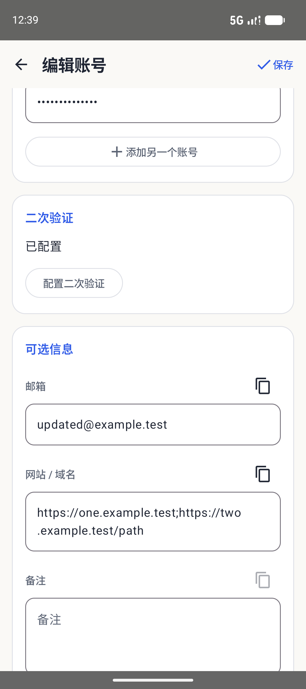
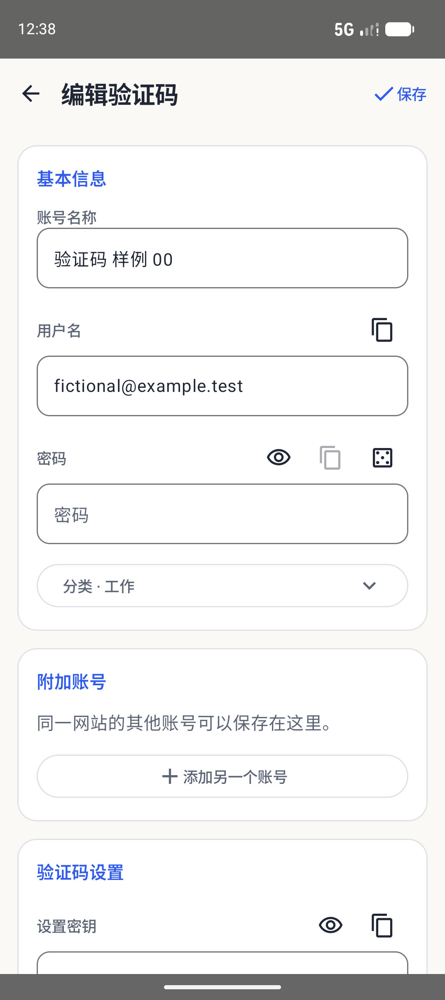
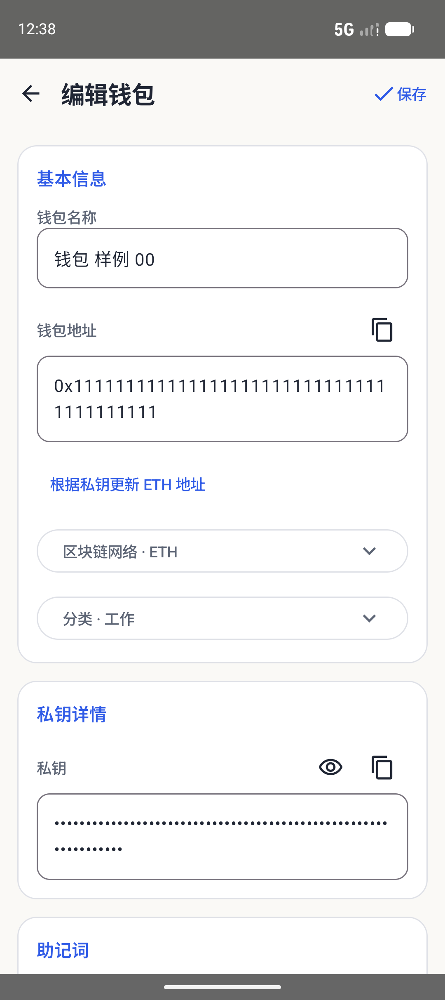
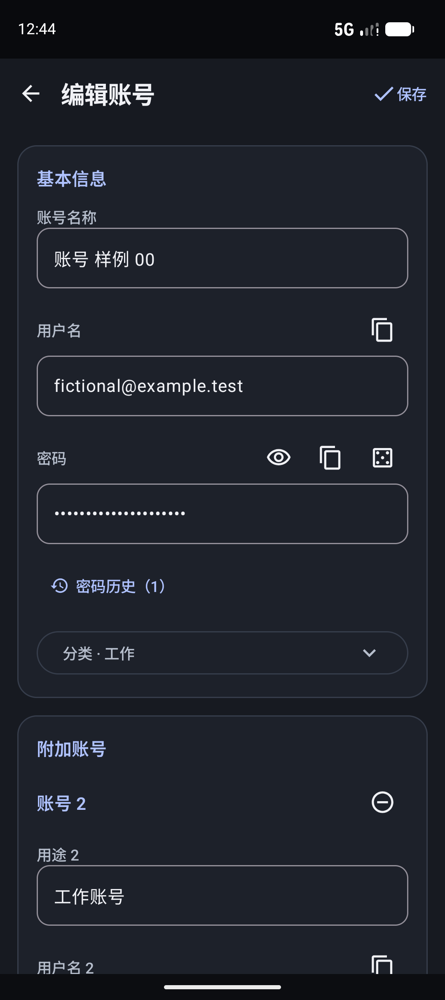
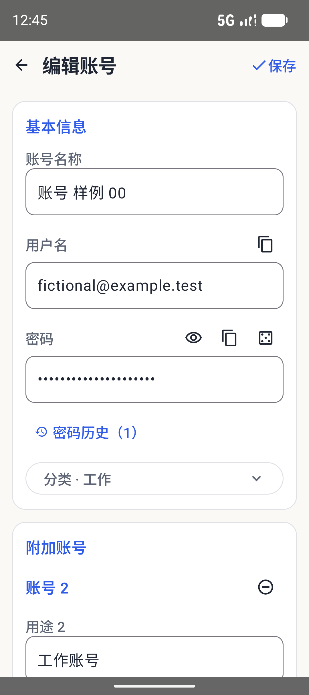

# Android legacy migration parity

The user requires the original application's interaction model, not merely compatible storage or similar cards. Notes retains the separately requested design. This checklist replaces the previous assumption that a read-only credential detail followed by Edit was acceptable.

## Authoritative references

- `lib/features/vault/presentation/pages/add_account_page.dart`: editable account/wallet fields, extra logins, history, selectors, wallet derivation and display options.
- `lib/features/vault/presentation/pages/vault_workspace_page.dart`: collection tools, selection, sort/filter and import/export entries.
- `lib/features/vault/presentation/widgets/password_item_card.dart`, `crypto_item_card.dart`, and `lib/features/totp/presentation/widgets/totp_item_card.dart`: primary and secondary record actions.
- `lib/core/utils/import_export_helper.dart`: JSON/CSV and provider import mappings.

## Acceptance matrix

| Area | Required behavior | Evidence/status |
| --- | --- | --- |
| Account/wallet entry | Tap once to edit; Save returns to the same collection position | Direct-account migration and same-position return pass in the final 22-test APK run |
| Primary account | Name, login, password, email, full multi-domain value, notes; reveal/copy/generate | Name/password/email and retained-field round trip pass |
| Additional accounts | Add/remove, purpose, login, password, independent generation/copy/history, stable IDs | Add/remove/recreate/save/reopen with stable IDs and history pass |
| Draft cancellation | Cancel never writes; recovered editor uses persisted history baseline | Cancel/recreate/persistent delete baseline passes in the final APK run |
| Account 2FA | Configure/clear/cancel, normalized setup key, live collection code | Existing secret/period survive account editing/recreation; configure/clear/cancel use a local draft, save validates through core. |
| Codes | Tap copies; menu edits/exports/deletes; QR automatically populates fields; multiline link import | TOTP tap-copy/menu-edit, legacy login editing and invalid/valid multiline imports pass; URI round trip passes. Camera-specific checks are documented below. |
| Wallet | Editable network/address/key/numbered words, complete BIP39 suggestions, independent derivation source and automatic valid updates | 24-word/private-key edit/recreation/delete/restore passed; delayed stale-result gate regression passed |
| Metadata | Existing/default/new categories, new networks, add/remove tag chips, shared destination, pin/color | Selectors/shared default are wired to encrypted metadata and permission checks; viewer-write rejection passes. Physical interaction acceptance remains separately tracked. |
| Cards | All tags, multiple-account count/copy chooser, code/interval, expiry/health/color | Fixture UI shows tags, extra-account count, code/countdown and masked fields; direct edit/copy tests exercise primary actions. |
| Collection | Email search, four persistent sorts, shared filter, scroll/selection retention | Long-list selection, empty shared filter reset, email search and persisted sort state pass. Search changes clear hidden selections. |
| Batch actions | Delete only toward Trash, pin/unpin, tag, set/clear color; await writes and accurate outcomes | Service permission/idempotency and long-list two-item batch tests pass in the final APK run |
| Transfer | Legacy encrypted JSON/CSV, native backups, provider CSV, plain JSON/CSV export | Provider aliases/short rows and legacy/native encrypted imports implemented. New encrypted CSV uses the native envelope (Argon2id/AES-GCM), not the legacy SHA-256-only writer; core round trip/tamper/atomicity tests passed. Installed older clients need an update to read the new CSV envelope. Full native backup remains the complete migration format. |
| Permissions | Read-only data remains readable; cannot create/write in viewer destination | Viewer-role mutation rejected in encrypted sync fixture; readonly target New/edit controls remain disabled. |

Old defects must not be copied: fixed 12-word truncation, unawaited batch writes, using unsaved recovery content as the deletion baseline, or deriving an edited private key from an unrelated old phrase. Preview security, encrypted storage and the user's existing mobile vault must remain intact.

Previous scoped design ratings do not replace this checklist. Hardware camera/fingerprint, full accessibility, signed release and old-OS gates remain separate; do not infer those from the preview regression suite.

## Additional migration checks

- Old TOTP records retain editable login password, extra accounts, history and expiry alongside the code settings.
- Search/filter changes clear selection, preventing bulk edits to hidden records. Selecting hides New; empty shared-vault filters can be cleared.
- The generator restores the 4–64 range and upper/lower/digit/symbol controls. An empty alphabet disables generation/copy.
- Live scanning uses CameraX 1.4.2 Preview + ImageAnalysis and the existing ZXing decoder. It validates through the core before accepting once; close/back/lifecycle changes invalidate queued callbacks. No frame is written to storage. QR image import remains available.
- Camera implementation references: [preview](https://developer.android.com/media/camera/camerax/preview), [analysis and lifecycle/backpressure](https://developer.android.com/media/camera/camerax/analyze), [pinned release](https://developer.android.com/jetpack/androidx/releases/camera#1.4.2).
- Physical camera/fingerprint, full TalkBack and older Android hardware remain separately tracked device gates. Emulator/native tests must not be described as those hardware checks.

The complete English recovery-word suggestions use rust-bip39 2.2.2's 2048-word list; see [source and license](BIP39-NOTICE.txt).

## Final preview package evidence

The clean ARM64 2.1.5 preview (21007) is 15,423,775 bytes. All 22 Android instrumentation tests pass against that exact application APK (`parity-final-all-tests.log`), covering Autofill, core lifecycle, collection/detail/security UI, Notes editing, draft/idle failures, history, direct legacy editing, wallet/source recovery, batch permissions, CSV formats, generator/QR utility behavior, local sharing and WebDAV. The shared core passes 25 Rust tests and strict Clippy. APK signature plus ZIP/ELF 16 KB alignment pass.

Live camera opening/closing runs in the emulator. Four QR frame orientations and session cancellation/pause/duplicate-result rejection pass separately. An extra virtual-scene poster experiment did not put its QR into the visible camera scene, so it did **not** establish end-to-end live scanning; its failed diagnostic is retained as `parity-live-camera.log`, not counted as a passing test. Physical scanning remains a device gate.

Evidence and private upgrade snapshots remain in ignored `native-test-output/mobile/`; only fictional screenshots may be copied into public documentation.

Mi 10 / Android 13 runs the 2.1.5 / 21007 preview after an in-place ADB upgrade. Eleven isolated non-UI tests pass (`parity-phone-tests.log`); encrypted header and database hashes match before installation and after testing, preserving the existing vault without rewriting it. The temporary instrumentation helper was removed and the normal app reopened. This preview upgrade does not establish original production-signing-key continuity, foreground hardware UI acceptance or all legacy migration formats.

The same application APK passes all three credential/security UI tests separately in dark mode and at 1.3× font scale (`parity-dark-tests.log`, `parity-large-tests.log`). Font scale is restored to 1.0. The wallet restore check additionally waits for the restored row to be visible before capturing its screenshot (`parity-wallet-final.log`, 1 pass).

## Fictional UI evidence

| Direct account editing | Additional logins |
| --- | --- |
|  |  |

| Code editor | Wallet editor |
| --- | --- |
|  |  |

| Dark mode | Large text |
| --- | --- |
|  |  |

## Interaction review

The independent interaction-design review scores this Android migration UI and its verified flows **9.1/10** (weighted 9.135), exceeding the requested >9 threshold. It reviewed 27 light, 15 dark and 15 enlarged-text screenshots and independently checked the final test logs. No P0/P1 delivery blocker remains in this scope.

| Dimension | Weight | Score |
| --- | ---: | ---: |
| Legacy features and main tasks | 30% | 9.2 |
| Drafts, failure recovery and mistake prevention | 25% | 9.3 |
| Navigation and efficiency | 15% | 9.2 |
| Feedback and wording consistency | 15% | 8.8 |
| Layout, dark theme and enlarged text | 15% | 9.0 |

Nonblocking polish: some password-change times still use ISO formatting; bilingual copy feedback occupies extra space with enlarged text. The score excludes end-to-end physical camera recognition, fingerprint hardware, full TalkBack, old-OS device acceptance, production security and completion of other platforms.

## 2.1.6 Notes action alignment

Notes uses the same primary/onPrimary colors and 18dp Add-button shape as Accounts, Codes and Wallets. The navigation item, note cards and reading layout are unchanged. The clean ARM64 compact preview is 15,423,783 bytes; APK signature verification and 16 KB ZIP alignment pass. The exact compact package passes the English screenshot/creation flow and the Chinese Notes design flow in light mode (2 tests), plus the English flow in dark mode (1 test). These checks do not repeat the entire 2.1.5 parity suite or physical-device acceptance above.

The English [Notes](design/android-native/notes-en.png) and [account editor](design/android-native/account-editor-en.png) captures contain only fictional English content. The Chinese [Notes capture](design/android-native/notes.png) is refreshed with the same button styling. `ReadmeScreenshotsTest` generates these images from a UUID-scoped test vault and restores the previous language preference afterward.
