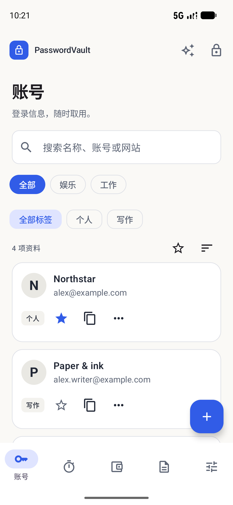
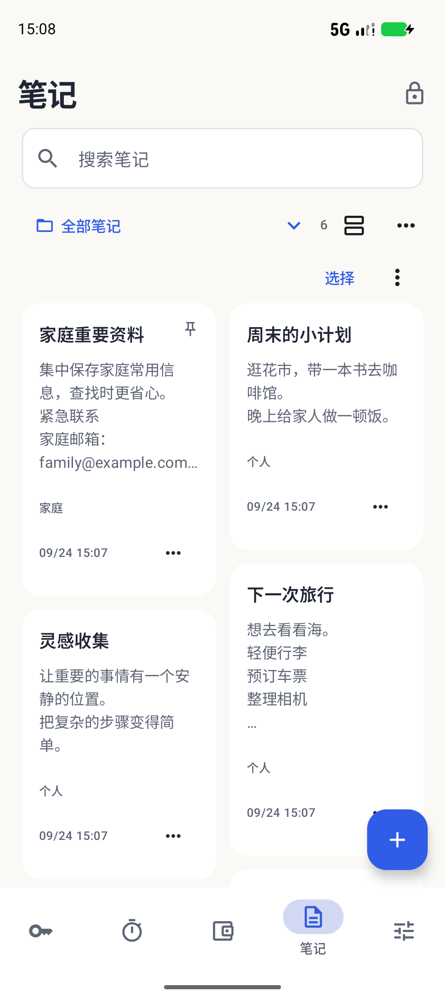
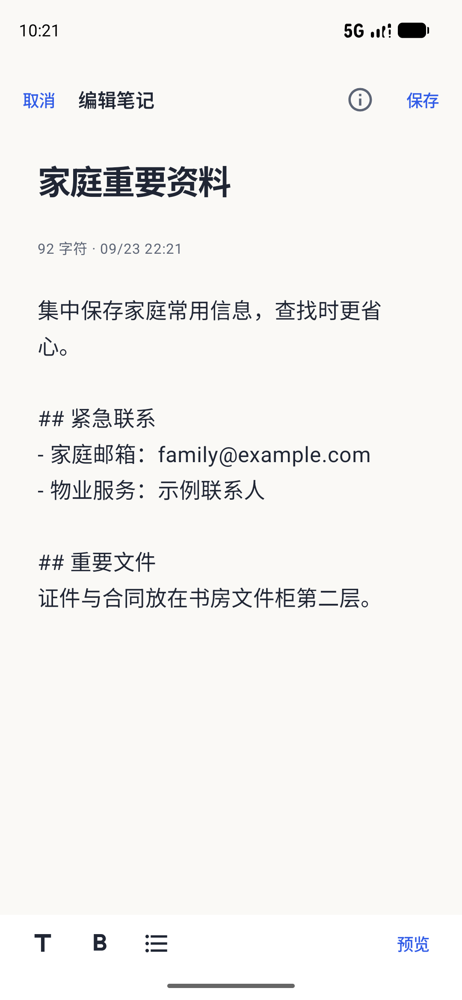
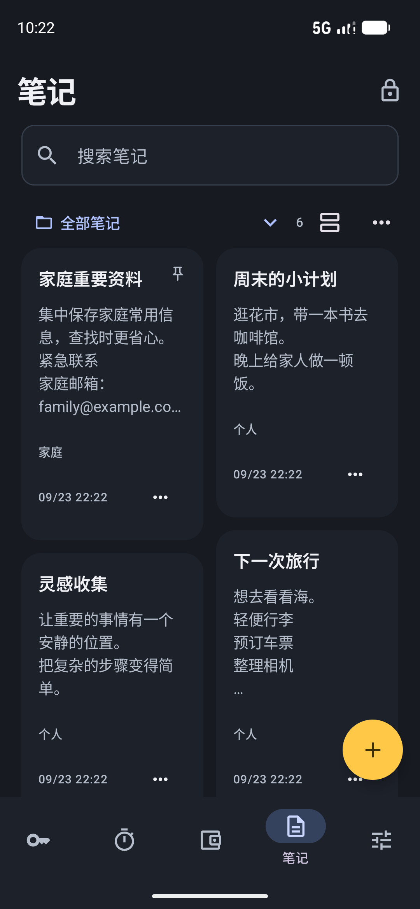
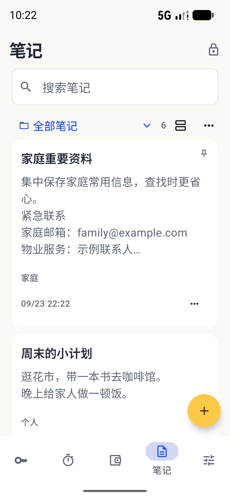
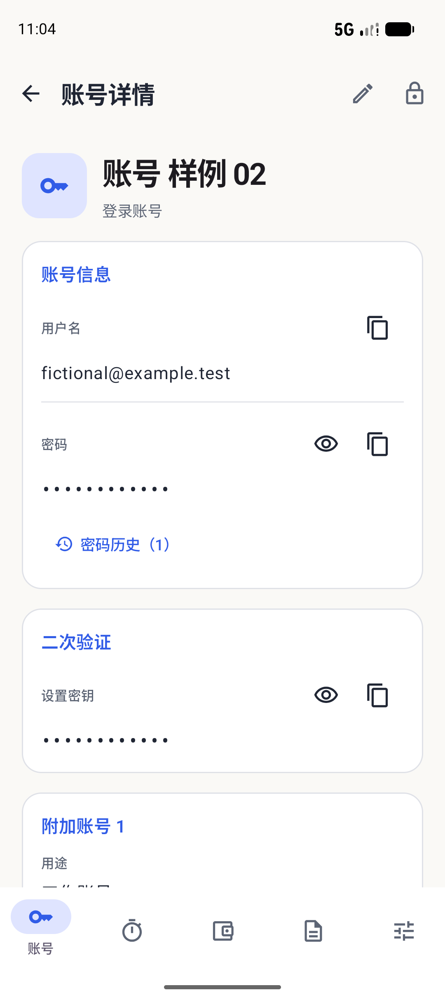
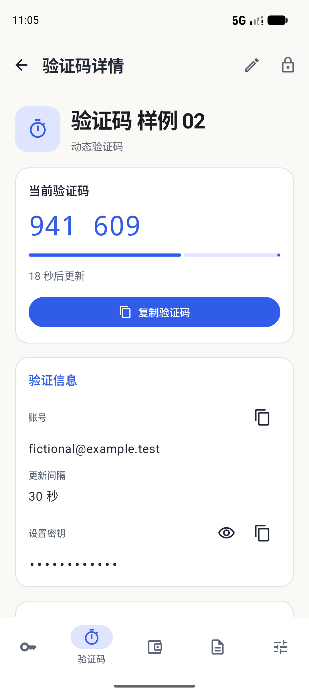
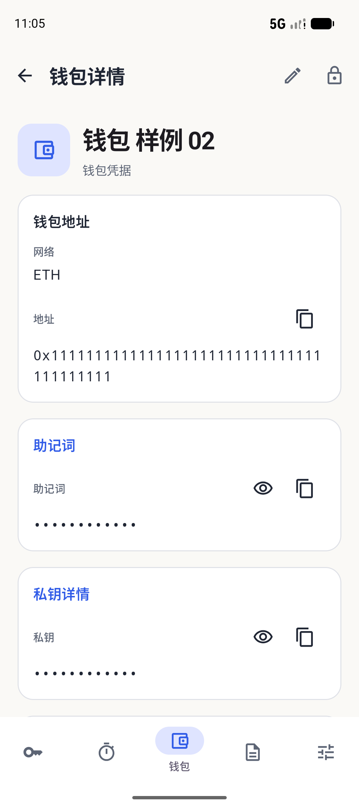
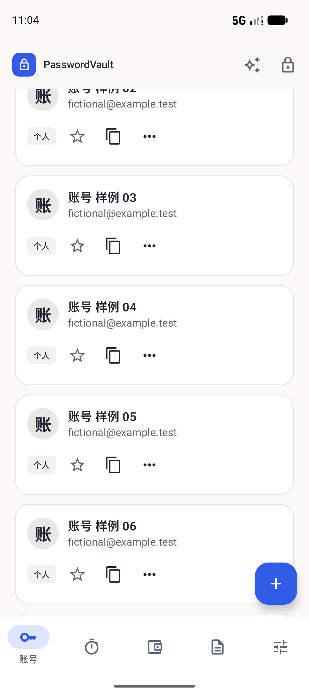
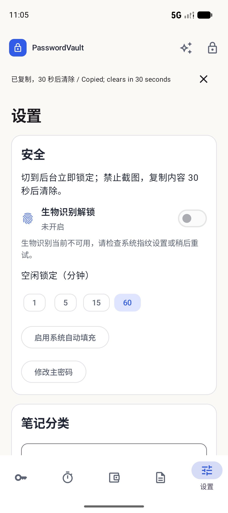

# Android UI refresh

## Reference and scope

The native Android client follows the original PasswordVault account UI: warm off-white background, blue accents, bordered white cards, search/filter controls and Accounts → Codes → Wallets → Notes → Settings navigation. References are the legacy `lib/core/theme/app_theme.dart`, `lib/features/vault/presentation/pages/vault_workspace_page.dart` and `docs/images/vault-mobile.png` component render. This is a native adaptation, not a pixel-identical Flutter replacement.

Notes is a separate workspace inspired by Xiaomi Notes: a prominent title, compact folder controls, a two-column masonry overview, plain text cards and a create button matching the other workspace pages (theme primary/onPrimary colors and an 18dp rounded shape). The [official MIUI 14 guide](https://alsgp0.fds.api.xiaomi.com/gl123/Generic%20User%20Guide%20for%20MIUI%2014/Generic%20User%20Guide%20for%20MIUI%2014.pdf) informed the search, folder, pin and delete interactions. No Xiaomi assets or branding are included. This change does not restyle iOS, Mac or the browser extension.

## Implemented behavior

- Account cards retain avatars, usernames, tags, favorites, copy and contextual actions. Secrets are not displayed on collection cards.
- Notes support folders, search, grid/list switching, timestamps, favorites, pinning and long-press actions. Large font settings use a single column on a phone.
- The note reader emphasizes title and content. A dedicated full-screen editor provides explicit Save, Markdown heading/bold/list controls and preview. Category, tags and shared-vault selection sit behind Note information.
- Leaving modified content offers Save, Discard or Keep editing. Activity recreation restores the draft and its original tab without treating unsaved changes as clean. Encrypted background draft recovery remains in place; this UI does not promise automatic saving of every edit.
- Read-only shared destinations cannot be selected for a write. Delete/restore and confirmed permanent deletion retain existing permission checks.
- Password history is based on persisted records, including after draft recovery. Retrying an already saved draft preserves history without duplication.
- Light/dark palettes and system bars match. The real vault continues to use the shared encrypted repository and protected windows. Screenshots below use only a UUID-isolated fictional test vault.

## Screenshots from the running Android app

| Accounts | Notes |
| --- | --- |
|  |  |

| Editor | Dark notes | Large text notes |
| --- | --- | --- |
|  |  |  |

## Validation

The compact ARM64 preview passes all 9 instrumentation tests on the API 37 / 16 KB emulator, including CRUD/Trash/lock, real-keyboard editing, activity recreation, password-history retries, encrypted persistence/drafts, Autofill, WebDAV and LAN sharing. The design flow also passes separately in dark mode and at 1.3× font size. Screenshot comparisons use a 390 × 844 logical viewport; device display overrides are restored after testing.

Evidence stays in ignored `native-test-output/mobile/`: `ui-all-tests.log`, `ui-design-dark.log`, `ui-design-large.log`, and `ui-final-package-tests.log`. The corresponding test sources are `DesignFlowTest.kt`, `VaultFlowTest.kt` and `EntryHistoryTest.kt` under the Android instrumentation source directory.

The same 2.1.3 / 21005 APK was upgraded in place on Mi 10 / Android 13 with ADB, preserving the preview vault and both legacy applications. Six non-UI device tests pass: encrypted persistence, draft failure recovery, idle timing, password history, LAN sync and WebDAV. The temporary instrumentation package was removed afterwards. APK signature and 16 KB ZIP alignment checks pass.

MIUI restricts ADB input and instrumentation foreground launches on the connected phone. Emulator UI results are not a claim of physical-device UI, full TalkBack, biometric, camera, signed-upgrade or production acceptance. See [remaining mobile gates](MOBILE-IMPLEMENTATION.md#remaining-gates).

## 2.1.3 interaction review

The interaction-design sub-agent independently reviewed 13 final full-resolution screenshots and the 9 + 1 + 1 passing test logs. Its scoped score is **9.1/10** (weighted 9.12), with no blocking issue for this Android UI delivery.

| Dimension | Weight | Score |
| --- | ---: | ---: |
| Core task completion | 30% | 9.2 |
| Draft, deletion and recovery reliability | 25% | 9.3 |
| Navigation and discoverability | 15% | 9.1 |
| State and failure feedback | 15% | 8.8 |
| Readability and basic accessibility | 15% | 9.0 |

Some failure messages remain generic. Full TalkBack, larger font scales, manufacturer keyboards and hardware permissions are outside the verified scope; the score is not production acceptance.

## 2.1.4 collection, security and detail refinement

Account, verification-code and wallet headings/search/filters scroll with their records in a single list, freeing the viewport after scrolling. Returning from details preserves the list position and filters in workspace memory. Notes retains its separate design.

Credential detail cards follow the legacy grouped form: blue section headings, rounded bordered surfaces and distinct inline reveal/copy actions. Account details retain additional logins, hidden password history, email, and the account-associated two-factor setup key. Codes prioritize the current value, remaining interval and copy action. Wallet network sits beside the complete address; recovery words use their actual word count and stay hidden initially. Sensitive field state is scoped to the selected record.

Security uses a real enabled-state switch, separate renewal, pending verification and local outcome messages. An unavailable biometric device does not prevent turning off an existing setup. Preference observation refreshes the switch after password changes, with explicit key removal to support notification behavior on older Android versions.

`CredentialLayoutTest` covers long collections of all three types, return position/search persistence, hidden/revealed credentials, associated two-factor keys, full address copying, biometric control states and external disabling. The biometric presentation fixtures do not authenticate with a physical fingerprint and are not hardware acceptance.

| Account details | Verification-code details | Wallet details |
| --- | --- | --- |
|  |  |  |

| Scrolled collection | Security state |
| --- | --- |
|  |  |

### 2.1.4 acceptance

The final clean-built compact ARM64 package passes all 12 instrumentation tests, followed by the 3 credential/security tests in dark mode and again at 1.3× font scale. The emulator display configuration is restored afterwards. Logs: `ui-detail-all-tests.log`, `ui-detail-dark.log`, `ui-detail-large.log` under ignored local mobile output. APK signature and 16 KB ZIP alignment checks pass; package size is 14,634,904 bytes.

The same APK was upgraded in place on Mi 10 / Android 13, preserving the encrypted vault byte-for-byte. Six isolated device tests pass after installation, and the encrypted real vault remains unchanged after those tests. The instrumentation helper is removed and the application reopened. Hardware fingerprint, camera, full TalkBack and old-OS acceptance remain separate.

The interaction-design sub-agent independently reviewed all 15 light screenshots and 20 key dark/large-text screenshots plus the 12 + 3 + 3 passing test results. Its final scoped score is **9.2/10** (weighted 9.17): task completion 9.3 (30%), state/recovery reliability 9.2 (25%), navigation/action hierarchy 9.2 (15%), feedback 9.0 (15%), readability/basic accessibility 9.0 (15%). No blocking issue was found. Hardware authentication, full TalkBack and older Android device behavior remain unverified.

## 2.1.5 legacy interaction parity

Accounts and wallets now open directly in full-screen editable forms. Additional logins retain IDs, labels, separate histories and per-field actions. Migrated TOTP records also expose their legacy login fields. Default/custom categories, network selection, shared destinations, tags, expiry, pin and color controls follow the original workflows. Wallets retain all recovery words, use the last edited derivation source and discard stale asynchronous results.

Collection tools restore persisted sorting, email search, shared filters, selection and awaited batch operations. Search/filter changes clear hidden selections, header recycling preserves ongoing selection, and New is hidden during selection. The generator restores character classes and the 4–64 range; scanning uses a live preview with validation and cancellation protection.

The authoritative [migration matrix](ANDROID-LEGACY-PARITY.md) records the legacy source references and verification scope. Native CSV export deliberately uses authenticated native backup encryption; the legacy weaker writer is not restored. All backup imports retain existing records unless explicitly changed by the merge rules.

2.1.5 acceptance: final APK 22 instrumentation tests, dark 3, large text 3, wallet restoration recheck 1 and Mi10 non-UI 11 pass. The independent migration-interaction score is **9.1/10** (9.135 weighted); see the matrix for screenshots and unverified hardware boundaries.
