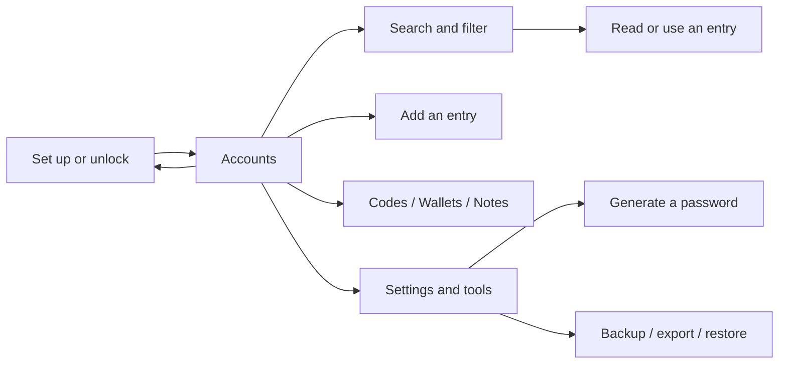

# Page structure

Native Mac 2.0.7 retains **Settings → Security → Idle lock → Never** and uses one continuous rendered editor that hides recognized Markdown syntax. **Edit / Preview** share the same typography, and clicking Preview enters Edit directly. Click anywhere in the body and type, select across paragraphs, or use **⌘Z / ⇧⌘Z** and the Edit menu. The source view remains available for plain Markdown editing. Titles and body changes save automatically; undo/redo also enter the save queue. Switching notes or locking clears that editor's undo history; shared read-only notes and Trash stay read-only.

Browser 2.0.9 offers the password-field menu on HTTP(S) pages and same-origin embedded login pages. Click the PasswordVault field button and select an account; no form is submitted. Formless login panels may pair one nearby, explicitly labelled account field with one password field, but ambiguous layouts only fill the chosen password. Navigation, field replacement and changed account-field identity cancel pending fills. Showing/hiding an identified password retains its button. Cross-origin frames and closed shadow roots remain unsupported. Login submissions inside a same-origin frame or an unambiguous form-less panel now produce a main-page save reminder. Clicking Review opens the trusted extension review; Dismiss clears pending data and cancels in-flight capture. Native form validation runs before capture, including clicks on nested button text. No login is automatically submitted or saved. Pending confirmation appears directly below the website, before reminder settings and the folded saved-account list. Account and password are editable; an accessible eye button reveals/conceals the password. Cancel save and Save remain visible at the standard 380×600 popup size, including two-line origins and errors. Leaving the window, changing pending records, saving or cancelling conceals the password. Polling retains local edits until the pending record changes or expires.

PasswordVault is a Flutter application with a shared workspace and routed tools. This guide describes application screens and interactions; the README is the current product presentation surface. Visual tokens live in [DESIGN.md](../DESIGN.md).

## Routes and screen ownership

Routes are declared in [`lib/main.dart`](../lib/main.dart). All routes below except `/lock` wrap their content in `AuthGuard`, which renders the lock page until authentication succeeds.

| Route | Screen |
| --- | --- |
| `/lock` | Master-password setup/unlock and language selection |
| `/` | `MainNavigationScreen`: Accounts, Codes, Wallets, Notes, and Settings |
| `/add-account` | Entry editor; receives an optional `VaultItem` for editing |
| `/password-generator` | Password result, options, copy, and extension-only fill |
| `/backup` · `/webdav-config` | Backup/restore and configured WebDAV destination |
| `/recycle-bin` · `/security-audit` | Trash and password-health tools |
| `/local-sync` | Local sync controls |
| `/sharing` · `/sharing/create` | Shared vault list and creation |
| `/sharing/public-key` · `/sharing/lan-discovery` | Sharing identity and local discovery |
| `/sharing/add-member/:vaultId` · `/sharing/details/:vaultId` | Membership and shared-vault details |

The five workspace destinations are retained views within `/`, not separate URL routes. `vault_workspace_page.dart` owns the responsive shell, search, list views, and settings. TOTP scanning uses `ScanCodePage` from the entry editor; it is not a top-level GoRouter route. After a supported code is validated, scanning stops and the result returns to the editor for review and saving. Manual entry remains available when camera access is denied.

## Information architecture

The default destination is **Accounts**. The visible order is **Accounts, Codes, Wallets, Notes, Settings**; internal stored indices remain compatible with the existing implementation.

| Destination | Main purpose | Primary action |
| --- | --- | --- |
| Accounts | Browse saved website credentials and account variants | Add an account |
| Codes | Browse TOTP authenticator entries | Add an authenticator entry |
| Wallets | Browse wallet credential records | Add a wallet record |
| Notes | Browse secure notes | Add a note |
| Settings | Adjust security, appearance, data, and collaboration options | Choose a specific setting or tool |

The top bar exposes the password generator and lock action. A wide sidebar adds shortcuts to the generator, password health, backups, shared vaults, and trash. These tools remain reachable through Settings on compact screens. They are secondary tasks, not extra top-level destinations.

The diagram shows navigation and intent. It does not imply that the unlock or recovery implementation has passed a security audit.

## Responsive behavior

| Surface | Current behavior |
| --- | --- |
| Workspace below 840 logical pixels | Bottom navigation; the selected destination displays its label; search remains visible on content views |
| Workspace at 840 logical pixels and above | Persistent side navigation and tool shortcuts beside the content |
| Workspace with a keyboard open or height below 560 logical pixels | The heading, filter rows, and list toolbar collapse to leave more space for search results |
| Account cards | At a card width of 620 logical pixels or more, content and actions sit side by side; below that width, metadata and actions wrap beneath the identity |
| Lock form | Centered, scrollable content with a maximum width of 460 logical pixels |
| Generator | Maximum content width of 1040; at an internal width of at least 800 and text scale at most 1.5, result and options appear side by side; otherwise they stack |
| Returning to a destination | Mounted views and list scroll positions are retained for the workspace session |

Responsive width is not a platform support claim. The source does not include native desktop runners. Larger text may require a single-column layout even on a wide screen.

## Interaction details

### Search and filtering

Search accepts titles, usernames, and domains. **⌘K / Ctrl+K** focuses the visible search field. The clear action resets the query; the empty-search action clears the active filters so the user can recover from a no-match state.

Categories, tags, favorites, sorting, and the shared-vault indicator remain distinct from the query. A count or an empty result describes the current view, not the full vault. Errors must offer retry rather than suggesting the vault is empty.

### Browsing and selection

The workspace keeps destination order consistent between compact and wide layouts. Switching destinations clears batch selection; returning to a mounted list preserves its browsing position. **Escape** exits selection when it is active, otherwise it removes focus from search.

Entry type determines the form opened by the add action. Empty libraries offer adding the first relevant entry. Destructive operations remain explicit; the presentation redesign must not bypass existing confirmation or recovery behavior.

Account cards keep the service identity and username together. Health, expiry, and tag metadata wrap below instead of competing with the title. On wide cards, favorite, copy, extension fill, and more actions sit alongside the content. On compact cards, the action group shares a wrapping row with metadata. Cards have no fixed height. The more menu exposes **Edit** and **Move to trash**, so deletion does not depend on discovering a long press. Moving an item to trash retains confirmation and reports completion only after the operation succeeds.

For entries containing multiple account variants, copying the primary account uses the default account selection. Clipboard success is reported after the write completes, with a retryable message when the platform rejects it. TOTP content and metadata wrap on narrow cards.

### Set up and unlock

The lock page groups the brand, introductory copy, form, and developer-preview notice. Language selection is available before unlock. Password visibility is controllable; the keyboard advances to confirmation during setup and submits from the final field.

Inline errors use a live region. Submission shows progress and prevents duplicate requests. Authentication failures return to a retryable form. The existing biometric and master-password providers continue to own authentication; a redesigned lock form does not remedy persistent master-password storage.

### Generate and copy

The generator puts its result ahead of configuration. Length spans 4–64 characters, with uppercase, lowercase, number, and symbol switches. Changing an option regenerates the result. With all character types disabled, the interface explains what is missing and disables generation and copying.

Actions wrap to fit narrow layouts and increased text size. Copy feedback appears after the platform clipboard write succeeds; a write failure produces an error that can be retried. Extension-only filling remains conditional on the extension environment and reports busy, success, and failure states.

### Backup and collaboration

The redesign improves entry points to existing backup, import/export, local sync, and shared-vault pages. It does not change their protocol or storage design. Wording must identify the configured destination and meaningful failure state; it must not imply cloud synchronization is automatic or that all metadata is encrypted.

## Native V2 pages

`PasswordVaultApp` switches between an unmounted locked/unlocked view hierarchy. `WorkspaceView` has sidebar, list, and detail panes. `EntryDetailView` covers Markdown, account, code, and wallet details; `RecordEditor` handles forms. Settings include General, Security, Appearance, Browser, and Backups. BackupView, SharingView, GeneratorView, and PasswordAuditView own secondary tools. The browser popup and full workspace are separate entry points. In native mode, a saved-account row opens its Mac detail for editing; its separate Fill button fills the website. Additional-account navigation scrolls to that account, repeated clicks work, and closed/minimized Mac windows reopen. Independent-vault rows retain filling and never transfer their data to Mac. A locked vault must be unlocked before selecting the account. Current platform parity is tracked in [NATIVE-MIGRATION.md](NATIVE-MIGRATION.md).

The Mac Notes heading has **+** to add a category and **−** to remove the selected category; each category also has a delete context-menu action. Empty categories persist in the encrypted vault. Deletion keeps active notes in All notes and leaves trashed notes in Trash, clears their category references atomically, and preserves unrelated account categories. The built-in All notes view cannot be deleted. A category containing shared notes without edit permission cannot be removed. Tools is a full-width button: its icon, title, empty row area, and chevron all toggle the tool destinations.

### Native interaction details

- New immediately creates and selects a blank note/account/authenticator/wallet. Fill title, credentials and metadata directly in the detail; edits autosave with a visible retry action on failure. Unwanted blank entries use the normal recoverable Delete flow. See [Mac mobile-field parity](MAC-MOBILE-PARITY.md).
- Search includes Trash and clears detail selection when no matching record remains. Restoring a trashed record selects it in its original record-type destination.
- WebDAV separates server credentials from the backup-file passphrase. Successful connection collapses the connection form; progress and results remain above the scrollable list. Rows show server modification/creation time (or a labelled filename fallback), human-readable size, and explicit unknown values.
- Remote restore confirms the chosen file and merges newer records, including Trash state; current-only records remain. Completion reports changed-record count, including zero. A wrong passphrase retains the list and offers retry for that file. Export/import first flush pending note edits and stop if writes fail.

Settings navigation responds across each entire row. Expanded Tools has a visible container boundary and indented children, while Settings remains a separate destination. The shared native-button wrapper supplies hover feedback without replacing keyboard activation or system pressed states. WebDAV Restore opens a per-file password sheet; legacy encrypted filenames explain that the original legacy master password is required. Restore passphrases do not replace the separate new-backup passphrase.

## Native Android 2.1.3

- Phone bottom navigation and wide-screen rail follow the legacy order: Accounts, Codes, Wallets, Notes, Settings. Account collections restore category/tag filters, favorite filtering, sorting, copy and contextual menus in bordered cards.
- Notes have a dedicated adaptive grid/list, folder selector, favorite/sort menu and long-press actions. Tap opens the reader; Edit opens a full-screen title/body editor. Metadata is secondary.
- Mobile notes require explicit Save. Leaving changed/recovered content offers Save, Discard or Keep editing. Activity reconstruction preserves the in-memory dirty marker; background lock seals recovery and clears unlocked content. Untitled text can use its first nonempty line as the saved title.
- Settings groups existing controls into cards. Empty Trash has its own message; read-only shared destinations are disabled. No voice/image attachment controls are shown.

### Android 2.1.4 detail and collection behavior

Account, verification-code and wallet collections each use one vertical list containing the heading, search, filters and records. Their transient query/filter/list state stays in memory in the workspace while details are open; it is not serialized as plaintext saved state. Notes retains its independent grid/list design.

Credential details use the legacy card hierarchy with inline copy/reveal actions. Password accounts retain additional accounts, email and associated two-factor keys. Verification codes show the live code and remaining interval before their setup information. Wallet addresses and network are grouped; recovery words are numbered only after revealing them. Secrets and history remain hidden initially.

Security shows biometric On/Off state, a separate renewal action, pending verification, unavailable-device explanation and inline result. Successful password changes refresh the switch immediately through preference observation. Disabling removes explicit keys so observers are notified on Android versions before 11 too.

### Android 2.1.5 migration interaction

- Account and wallet cards open the editable grouped form directly. Explicit Save/Cancel preserves the collection position; viewer/Trash records remain read-only.
- Codes retain tap-to-copy and menu editing. Migrated code records expose their login password, extra logins/history and expiry in the editor.
- Collections support four saved sort orders, email search, shared-vault filtering and multiselect batch actions. New is hidden while selecting; query/filter changes clear selection, and header recycling cannot discard it.
- Editors expose existing/default/custom categories, network and sharing selectors, tag chips, color, favorite/pin, independent password generation/copy/history, and complete numbered recovery phrases. Wallet derivation tracks its source and rejects stale results after newer editing or explicit generation.
- Live QR scanning validates setup data before returning once; invalid codes remain in the scanner. Closing or backgrounding invalidates queued results. Image import remains an alternative. The generator restores four character classes and lengths 4–64.
- Legacy/provider CSV aliases and short rows are preserved. Plain export requires confirmation; new encrypted CSV uses the native encryption envelope. Full encrypted backups preserve richer migration metadata.

See [legacy parity evidence and remaining device gates](ANDROID-LEGACY-PARITY.md).
