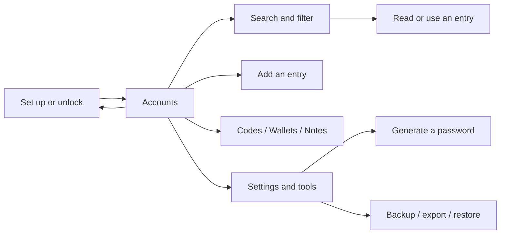

# Product design

PasswordVault should make a repeated task easy to recognize: find an account, use a credential, and return to what you were doing. The redesigned source organizes that path around readable lists, persistent search, clear actions, and a quiet visual theme.

This document describes the current presentation redesign and the criteria for future UI changes. It does not establish production readiness. The storage, cryptographic, backup, and sharing limitations in [SECURITY_MODEL.md](SECURITY_MODEL.md) remain open.

## Product direction

The documentation takes inspiration from Clipy's product presentation: lead with the job a person needs to do, show the actual interface, and provide a short route to a first successful session. PasswordVault keeps its own vault-specific information architecture and brand; illustrations explain the product without posing as implementation evidence.

| Principle | Application |
| --- | --- |
| Find before configure | Start in Accounts; show search without opening a separate mode |
| Reveal the next action | Keep add, generate, copy, and lock controls discoverable; empty states offer a useful action |
| Adapt without relearning | Preserve destination order and labels across the sidebar and bottom navigation |
| Let content carry the screen | Use restrained surfaces, readable metadata, and blue emphasis for primary actions |
| Tell the truth about state | Show loading, errors, and completion; distinguish a clean password-health report from application security |
| Preserve compatibility | Change presentation without renaming app IDs, database identifiers, or legacy formats |

## Information architecture

The default destination is **Accounts**. The visible order is **Accounts, Codes, Wallets, Notes, Settings**; internal stored indices remain compatible with the existing implementation.

| Destination | Main purpose | Primary action |
| --- | --- | --- |
| Accounts | Browse saved website credentials and account variants | Add an account |
| Codes | Browse TOTP authenticator entries | Add an authenticator entry |
| Wallets | Browse wallet credential records | Add a wallet record |
| Notes | Browse secure notes | Add a note |
| Settings | Adjust security, appearance, data, and collaboration options | Choose a specific setting or tool |

The top bar exposes the password generator and lock action. A wide sidebar adds shortcuts to the generator, password health, backups, shared vaults, and trash. These tools remain reachable through Settings on compact screens. They are secondary tasks, not extra top-level destinations.

The diagram shows navigation and intent. It does not imply that the unlock or recovery implementation has passed a security audit.

## Responsive behavior

| Surface | Current behavior |
| --- | --- |
| Workspace below 840 logical pixels | Bottom navigation; the selected destination displays its label; search remains visible on content views |
| Workspace at 840 logical pixels and above | Persistent side navigation and tool shortcuts beside the content |
| Workspace with a keyboard open or height below 560 logical pixels | The heading, filter rows, and list toolbar collapse to leave more space for search results |
| Account cards | At a card width of 620 logical pixels or more, content and actions sit side by side; below that width, metadata and actions wrap beneath the identity |
| Lock form | Centered, scrollable content with a maximum width of 460 logical pixels |
| Generator | Maximum content width of 1040; at an internal width of at least 800 and text scale at most 1.5, result and options appear side by side; otherwise they stack |
| Returning to a destination | Mounted views and list scroll positions are retained for the workspace session |

Responsive width is not a platform support claim. The source does not include native desktop runners. Larger text may require a single-column layout even on a wide screen.

## Interaction details

### Search and filtering

Search accepts titles, usernames, and domains. **⌘K / Ctrl+K** focuses the visible search field. The clear action resets the query; the empty-search action clears the active filters so the user can recover from a no-match state.

Categories, tags, favorites, sorting, and the shared-vault indicator remain distinct from the query. A count or an empty result describes the current view, not the full vault. Errors must offer retry rather than suggesting the vault is empty.

### Browsing and selection

The workspace keeps destination order consistent between compact and wide layouts. Switching destinations clears batch selection; returning to a mounted list preserves its browsing position. **Escape** exits selection when it is active, otherwise it removes focus from search.

Entry type determines the form opened by the add action. Empty libraries offer adding the first relevant entry. Destructive operations remain explicit; the presentation redesign must not bypass existing confirmation or recovery behavior.

Account cards keep the service identity and username together. Health, expiry, and tag metadata wrap below instead of competing with the title. On wide cards, favorite, copy, extension fill, and more actions sit alongside the content. On compact cards, the action group shares a wrapping row with metadata. Cards have no fixed height. The more menu exposes **Edit** and **Move to trash**, so deletion does not depend on discovering a long press. Moving an item to trash retains confirmation and reports completion only after the operation succeeds.

For entries containing multiple account variants, copying the primary account uses the default account selection. Clipboard success is reported after the write completes, with a retryable message when the platform rejects it. TOTP content and metadata wrap on narrow cards.

### Set up and unlock

The lock page groups the brand, introductory copy, form, and developer-preview notice. Language selection is available before unlock. Password visibility is controllable; the keyboard advances to confirmation during setup and submits from the final field.

Inline errors use a live region. Submission shows progress and prevents duplicate requests. Authentication failures return to a retryable form. The existing biometric and master-password providers continue to own authentication; a redesigned lock form does not remedy persistent master-password storage.

### Generate and copy

The generator puts its result ahead of configuration. Length spans 4–64 characters, with uppercase, lowercase, number, and symbol switches. Changing an option regenerates the result. With all character types disabled, the interface explains what is missing and disables generation and copying.

Actions wrap to fit narrow layouts and increased text size. Copy feedback appears after the platform clipboard write succeeds; a write failure produces an error that can be retried. Extension-only filling remains conditional on the extension environment and reports busy, success, and failure states.

### Backup and collaboration

The redesign improves entry points to existing backup, import/export, local sync, and shared-vault pages. It does not change their protocol or storage design. Wording must identify the configured destination and meaningful failure state; it must not imply cloud synchronization is automatic or that all metadata is encrypted.

## Visual system

The app uses Material 3 with a warm light canvas, ink-colored text, blue actions, and a corresponding dark palette. It relies on platform typography without adding a network font dependency. Reusable theme and surface helpers provide consistent forms and panels.

| Token | Light | Dark |
| --- | --- | --- |
| Primary action | `#315CE7` | `#AFC2FF` |
| Canvas | `#FAF9F6` | `#171A21` |
| Card | `#FFFFFF` | `#12151B` |
| Main text | `#202634` | `#F0F1F5` |
| Supporting text | `#5D6575` | `#B6BECC` |
| Border | `#DFE1E7` | `#363D4B` |

Buttons use a 48-pixel minimum height and 14-pixel corner radius; inputs use 12-pixel corners, cards 18, and dialogs 20. Body sizes are 14/16, titles 16/22, and headlines 28/32, with system text scaling retained. Secrets and generated codes use monospaced treatment where it aids reading.

Use theme colors for meaning, including errors and selected states. Avoid adding decorative gradients, unrelated illustrations, or status badges to routine credential rows. The product illustration belongs in explanatory material, while the live interface prioritizes content and controls.

## Content and localization

English is the default, with 简体中文 available throughout the app. Write actions as concrete verbs, such as **Copy**, **Regenerate**, **Unlock**, and **Clear search**. Keep UI strings in ARB catalogs and preserve equivalent placeholders; never translate stored identifiers or user-entered data.

Keep error messages adjacent to the action or field that caused them. Do not put build-system details into routine user flows. Maintain concise preview wording where it affects a person's decision to trust the build; link detailed limitations from the README and guides.

## Review and validation

Review affected pages in both themes and languages, narrow and wide layouts, with synthetic data. Include empty, populated, loading, error, long-text, and enlarged-text states when relevant. Verify keyboard focus, clear labels on icon actions, screen-reader announcements for form errors, and useful feedback after copy or save.

Run the [documented checks](../README.md#build-and-verify) and relevant interaction tests. The [README image suite](images/README.md) renders real Flutter widgets, but cannot validate platform clipboard permissions, biometrics, Android autofill, browser-extension boundaries, or device storage. Record those separately when tested on a real browser/device.

Further platform validation and security work remain in the [roadmap](ROADMAP.md). Do not remove a release blocker based on presentation changes or screenshots.

## Source map

| Source | Responsibility |
| --- | --- |
| [`app_theme.dart`](../lib/core/theme/app_theme.dart) | Theme, typography, component colors and shapes |
| [`app_components.dart`](../lib/core/widgets/app_components.dart) | Reusable presentation components |
| [`vault_workspace_page.dart`](../lib/features/vault/presentation/pages/vault_workspace_page.dart) | Responsive navigation, list state, search, tool entry points, settings |
| [`lock_page.dart`](../lib/features/vault/presentation/pages/lock_page.dart) | Setup/unlock form and authentication feedback |
| [`password_generator_page.dart`](../lib/features/vault/presentation/pages/password_generator_page.dart) | Responsive generator and copy/fill feedback |
| [`app_en.arb`](../lib/l10n/app_en.arb), [`app_zh.arb`](../lib/l10n/app_zh.arb) | User-facing language catalogs |
