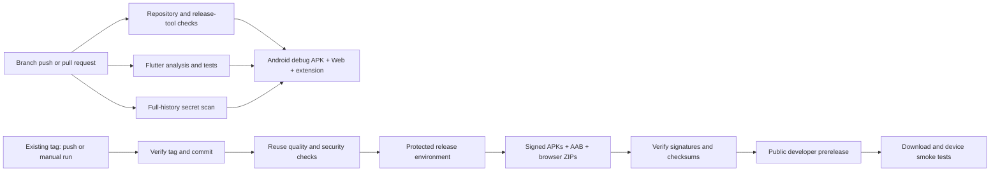

# Releasing PasswordVault

PasswordVault ships as a **developer preview**. Branch CI builds downloadable artifacts; a version tag triggers the release workflow, which **publishes a public prerelease directly, without draft mode**, after all checks pass. No app store deployment is configured, and passing CI does not close the [security release blockers](SECURITY_MODEL.md).

## Delivery flow



All Flutter jobs use the version in `.flutter-version`, the committed dependency lockfile, and the same `tool/check.sh` entry points used locally. Pull requests never receive Android release credentials. CI runs on all branch pushes, pull requests into `main`/`master` (including title edits), and manual runs. Tag releases reuse the quality/security jobs and build release assets themselves instead of repeating debug builds.

## Local checks and CI artifacts

Run commands from the repository root:

| Command | What it verifies or builds |
| --- | --- |
| `bash tool/check.sh repo` | Repository/localization consistency, release-tool regression tests, Chromium extension tests |
| `bash tool/check.sh flutter` | Exact Flutter pin, locked dependencies, localization/database generation, SQLite WASM version, formatting, analysis, tests and coverage |
| `bash tool/check.sh android` | Android debug APK; no private signing key |
| `bash tool/check.sh web` | Web and unpacked Chromium extension; validates required runtime assets |
| `bash tool/check.sh all` | All checks and the Android/Web/extension development builds |

The Flutter check rejects generated database drift rather than silently updating committed generated code. Run code generation and commit intentional changes before retrying. Python 3.11+ and a Node.js version supporting `node --test` are required for the repository checks; Android uses Java 17 and the SDK/NDK versions documented in the README.

The Actions run summary links to these downloads. GitHub sign-in is required for workflow artifacts.

| Artifact | Contents | Retention |
| --- | --- | --- |
| `android-debug` | Debug-signed development APK | 14 days |
| `web-preview` | Web build to serve over HTTP | 14 days |
| `chromium-extension-preview` | Directory to extract and load in Chrome/Edge developer mode | 14 days |
| `coverage` | `lcov.info` from Flutter tests | 7 days |
| `release-assets` | Signed packages, installation notes, licenses, build metadata and checksums | 7 days |

A debug APK cannot update an installation signed by a different key. Keep a tested backup before changing installations. Browser builds remain experimental; use synthetic credentials. CI currently validates Android, Web and the Chromium extension; iOS device/signing validation and desktop runners remain outside this pipeline.

## One-time release setup

1. Complete [public history cleanup](PUBLICATION.md). The private development keystore and its passwords were tracked; do not reuse them for public distribution. Decide how existing installations will migrate before changing the signing identity.
2. Generate a new private keystore outside the repository with Java's `keytool`. Keep a protected backup and record its certificate fingerprint. Do not place passwords in shell history.
3. Create a GitHub environment named `release`. Configure required reviewers and restrict deployment to reviewed release tags where your GitHub plan supports it.
4. Add environment secrets: `ANDROID_KEYSTORE_BASE64`, `ANDROID_STORE_PASSWORD`, `ANDROID_KEY_ALIAS`, `ANDROID_KEY_PASSWORD`, and `ANDROID_CERT_SHA256`. The fingerprint must match the reviewed value in `android/release-certificate.sha256`. Base64 encoding is not encryption.
5. Enable private vulnerability reporting. Select required repository, quality, secret-scan and platform checks from a successful CI run. Configure squash merge and require the English Conventional Commit PR title.

`tool/configure_signing.py` creates ephemeral files with private permissions and refuses to overwrite an existing keystore or configuration. It escapes Java properties without printing secret values and removes newly created files if setup fails. The release job always cleans up its ephemeral signing files. Signing secrets must never be supplied to pull requests, including forks.

## Prepare and run a preview release

1. Update the version/build number in `pubspec.yaml`, the matching numeric version in `chrome/manifest.json`, and `CHANGELOG.md`. Review the installation guidance in `docs/RELEASE_NOTES.md`.
2. Run the local checks, then review and commit the change. Complete the publication/history decision before pushing it.
3. Create a unique tag such as `v1.1.0-preview.4`. Its base version must match the manifests. Push the reviewed tag to start the release workflow; never overwrite an existing tag.
4. If a manual run is needed, select that **existing tag** as the workflow ref and enter the same tag in the input. For example:

   ```bash
   gh workflow run release.yml --ref v1.1.0-preview.4 -f tag=v1.1.0-preview.4
   ```

   The workflow must already be available on the default branch for manual dispatch. The CLI example starts a remote workflow; it is not part of the local check commands.
5. If the `release` environment has required reviewers configured, approve it after checking the source revision. Otherwise the job starts automatically. The pipeline verifies APK and AAB signatures against the configured and committed certificate, packages the files, verifies their checksum inventory, and uploads the assets.
6. The publish job downloads those exact artifacts, verifies their checksums again, rechecks the tag, and publishes a public developer prerelease. It verifies that the resulting release is not a draft. It never creates a missing tag or substitutes a different revision.

`tool/validate_release_ref.py` rejects missing tags and tag/commit mismatches before signing secrets are used. Manual dispatch cannot accidentally package one branch while labeling it as a different tag. Each build job checks out the validated commit. Existing releases are not silently overwritten: inspect a failed or partial publication and resolve it deliberately before retrying.

## Review the delivered files

The public release includes three APKs (`arm64-v8a`, `armeabi-v7a`, `x86_64`), one AAB, Web and extension ZIPs, `SIGNING-CERTIFICATE-SHA256.txt`, `BUILD.json`, `LICENSE`, `THIRD_PARTY_NOTICES.md`, `INSTALL.md`, and `SHA256SUMS`. `BUILD.json` records the tag, commit, Flutter version, expected Android certificate and, in CI, the Actions run URL. ZIP file ordering and timestamps are normalized; this does not claim that complete Flutter binaries are reproducible.

Download **all** release assets into a fresh directory. Verify them with:

```bash
# From this source checkout: also rejects missing or unexpected files.
python3 tool/package_release.py --verify /path/to/downloaded-assets

# Or, inside the downloaded-assets directory:
shasum -a 256 -c SHA256SUMS    # macOS
sha256sum -c SHA256SUMS       # Linux
```

Checksums detect corrupted or changed downloads. Verify the release source and signing identity separately. Use Android SDK `apksigner verify --print-certs` on each APK and compare the fingerprint with the reviewed certificate. Smoke-test installation and upgrade on Android, unlock and restore using synthetic data, Web loading, and unpacked Chrome/Edge installation. Confirm the limitations and release status are accurately described before pushing the release tag.

A failed or missing signing secret fails the release. The workflow never substitutes a debug signature or distributes an unsigned Android release. A signed release-mode binary is not a production security endorsement; production releases additionally require closing the documented security blockers.

## Local signed builds

Copy `android/key.properties.example` to `android/key.properties` and fill in the path and credentials locally. Use a private key that has never appeared in Git. Release Gradle tasks fail when signing settings are absent.

```bash
flutter pub get --enforce-lockfile
flutter gen-l10n
flutter build apk --release --split-per-abi --no-pub
flutter build appbundle --release --no-pub
bash tool/check.sh web
```

Verify signatures and the expected certificate before distribution. `RELEASE_TAG=v1.1.0-preview.4 python3 tool/package_release.py` stages the same package layout locally after builds exist; it refuses non-empty output directories and includes no keystore or private signing configuration. This packaging command does not itself prove the Android signature: run `tool/verify_android_signatures.py` with the expected certificate configured first.
