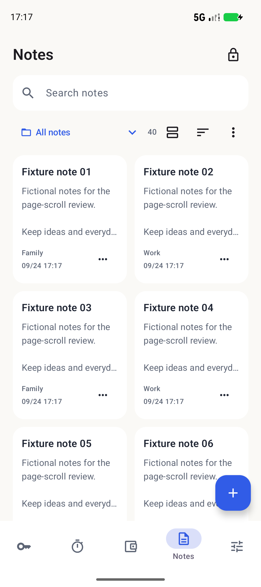
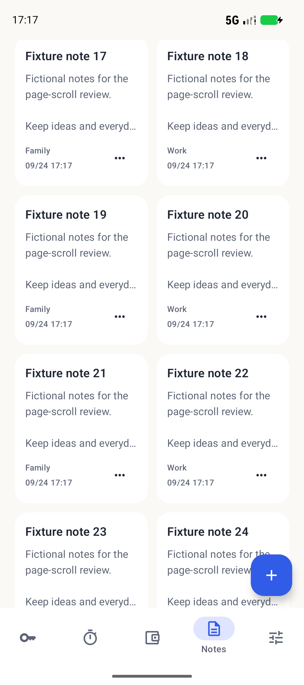

# Notes whole-page scrolling — Android 2.1.8

The Notes title, lock action, search, folder picker and collection tools share one scrolling surface with the note cards. Grid mode places the controls in a full-width item; list mode uses a regular list item. Empty and filtered-out results remain in the same scrolling surface, so controls do not consume a permanently fixed portion of the screen.

Bottom navigation and New remain available while scrolling. Selection mode retains its existing rule of hiding New. Returning from a note or another tab reuses the workspace's existing collection state, preserving filters and the corresponding grid/list position. This is in-memory navigation continuity, not a promise to restore a position after process termination.

The note reader retains its navigation bar. Other tabs, record fields, encryption and backup formats are unchanged.

## Regression coverage

`NotesScrollTest` creates an isolated encrypted fixture with 40 fictional notes and real folder operations. It checks both grid and list mode, scrolling controls out of view, note/detail and tab round trips, New/cancel, empty-folder filtering, empty searches, keyboard dismissal, selection and lock. Selected bottom-tab text is distinguished from the scrolling page title.

The existing `DesignFlowTest` and localized `ReadmeScreenshotsTest` supplement the scrolling-specific checks. All UI work uses a test emulator and fictional data; physical biometric, camera and broader accessibility acceptance remains separate.

## Running interface

Both captures show the same fictional fixture. Scrolling moves the complete Notes header out of view while preserving the bottom navigation and New action.

  
  

## Acceptance

The focused scroll test passed in light mode, dark mode and at 360 dp width with 1.8× text. Each run checked both grid and list navigation; returned note positions stayed within an 8 dp tolerance. The existing note design flow and English/Chinese README fixtures also passed. Selected-tab accessibility semantics and asynchronous keyboard visibility were accounted for in the test helpers without weakening the scrolling assertions.

The clean ARM64 compact package is **2.1.8-preview / 21010**, 15,440,179 bytes. Signature, 16 KB ZIP alignment and all five native libraries' ELF load-segment alignment passed. The emulator's display and font settings were restored after testing.

The interaction review scored this scope **9.2/10**: flow completeness 9.4, navigation continuity 9.4, adaptation 9.1 and action clarity 9.0. This review covers the Notes scrolling change; broader device hardware, TalkBack and older Android acceptance remain separate.

The package was installed over the existing Mi 10 preview with `adb install -r`. Version readback confirmed 2.1.8-preview / 21010, and the installed APK digest matched the validated artifact. No real vault was opened or read for this verification.
